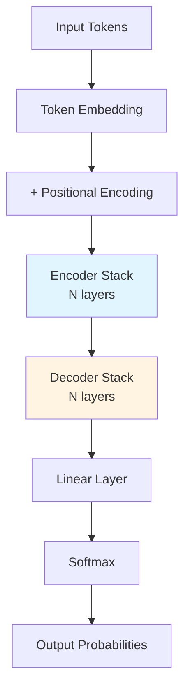
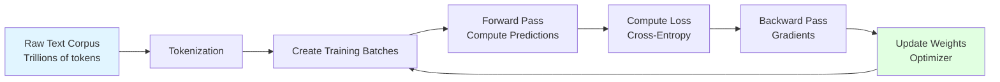
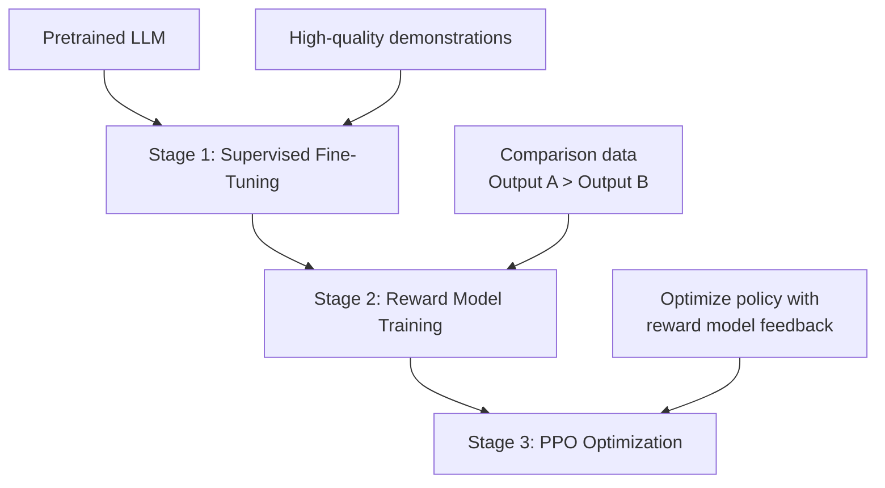

# Large Language Models & Transformers

## Table of Contents
1. [Transformer Architecture Overview](#transformer-architecture-overview)
2. [Self-Attention Mechanism](#self-attention-mechanism)
3. [Multi-Head Attention](#multi-head-attention)
4. [Positional Encoding](#positional-encoding)
5. [Encoder-Decoder Architecture](#encoder-decoder-architecture)
6. [LLM Training](#llm-training)
7. [Fine-Tuning Strategies](#fine-tuning-strategies)
8. [Interview Insights](#interview-insights)

---

## Transformer Architecture Overview

### What is a Transformer?

The Transformer is a neural network architecture introduced in "Attention Is All You Need" (2017) that revolutionized NLP by replacing recurrent connections with self-attention mechanisms.

**Key Innovation**: Process entire sequences in parallel instead of sequentially (like RNNs).

### High-Level Architecture



### Transformer Block (ASCII Diagram)

```
                    Input Sequence
                         ↓
    ┌────────────────────────────────────┐
    │    Multi-Head Self-Attention       │
    │                                    │
    │  [Query]  [Key]    [Value]        │
    │     ↓       ↓        ↓            │
    │    Attention Mechanism             │
    └────────────────────────────────────┘
                         ↓
                    Add & Norm  ←─── Residual Connection
                         ↓
    ┌────────────────────────────────────┐
    │   Feed-Forward Network (FFN)       │
    │                                    │
    │   Linear → ReLU → Linear          │
    └────────────────────────────────────┘
                         ↓
                    Add & Norm  ←─── Residual Connection
                         ↓
                    Output Sequence
```

---

## Self-Attention Mechanism

### Conceptual Understanding

**Goal**: Allow each token to "attend" to all other tokens in the sequence to understand context.

**Intuition**: In "The cat sat on the mat", when processing "it", attention helps the model focus on "cat" rather than "mat".

### Mathematical Formulation

Given input sequence $X = [x_1, x_2, ..., x_n]$ where each $x_i \in \mathbb{R}^{d_{model}}$:

1. **Create Query, Key, Value matrices**:

$$Q = XW^Q, \quad K = XW^K, \quad V = XW^V$$

Where $W^Q, W^K, W^V \in \mathbb{R}^{d_{model} \times d_k}$

2. **Compute Attention Scores**:

$$\text{Attention}(Q, K, V) = \text{softmax}\left(\frac{QK^T}{\sqrt{d_k}}\right)V$$

### Step-by-Step Breakdown

**Step 1: Compute Scores**
```
Scores = Q × K^T
```
- Measures similarity between each query and key
- Produces matrix of shape [seq_len × seq_len]

**Step 2: Scale**
```
Scaled_Scores = Scores / √d_k
```
- Prevents gradients from becoming too small
- $d_k$ is the dimension of key vectors

**Step 3: Apply Softmax**
```
Attention_Weights = softmax(Scaled_Scores)
```
- Converts scores to probabilities
- Each row sums to 1

**Step 4: Weighted Sum**
```
Output = Attention_Weights × V
```
- Produces context-aware representation

### Why Scale by √d_k?

As $d_k$ increases, dot products grow large → softmax saturates → tiny gradients

**Mathematical Reasoning**:
- Dot product of two random vectors has variance $d_k$
- Dividing by $\sqrt{d_k}$ normalizes variance to 1

### Attention Score Visualization (ASCII)

```
Query: "cat"
         the    cat    sat    on    mat
the    [ 0.1   0.3   0.1   0.1   0.1 ]
cat    [ 0.1   0.7   0.05  0.05  0.1 ]  ← High self-attention
sat    [ 0.1   0.4   0.3   0.1   0.1 ]
on     [ 0.05  0.1   0.2   0.5   0.15]
mat    [ 0.1   0.2   0.1   0.1   0.5 ]

Values closer to 1 = stronger attention
```

### Pseudocode Implementation

```python
def self_attention(X, W_Q, W_K, W_V, d_k):
    """
    X: [batch, seq_len, d_model]
    W_Q, W_K, W_V: [d_model, d_k]
    """
    # Linear projections
    Q = matmul(X, W_Q)  # [batch, seq_len, d_k]
    K = matmul(X, W_K)  # [batch, seq_len, d_k]
    V = matmul(X, W_V)  # [batch, seq_len, d_k]
    
    # Compute attention scores
    scores = matmul(Q, transpose(K))  # [batch, seq_len, seq_len]
    scores = scores / sqrt(d_k)
    
    # Apply softmax
    attention_weights = softmax(scores, dim=-1)
    
    # Apply attention to values
    output = matmul(attention_weights, V)  # [batch, seq_len, d_k]
    
    return output, attention_weights
```

---

## Multi-Head Attention

### Why Multiple Heads?

Single attention head captures one type of relationship. Multiple heads learn different patterns:
- **Head 1**: Syntactic dependencies (subject-verb)
- **Head 2**: Semantic relationships (synonyms)
- **Head 3**: Positional patterns (nearby words)

### Architecture

```
Input Embedding (d_model = 512)
           ↓
    Split into h heads (h = 8)
           ↓
    ┌─────────────────────────────┐
    │  Head 1   Head 2  ...  Head 8│
    │  (d_k=64) (d_k=64)    (d_k=64)│
    │     ↓        ↓           ↓   │
    │  Attention Attention  Attention│
    └─────────────────────────────┘
           ↓
    Concatenate all heads
           ↓
    Linear projection (W^O)
           ↓
    Output (d_model = 512)
```

### Mathematical Formulation

$$\text{MultiHead}(Q, K, V) = \text{Concat}(\text{head}_1, ..., \text{head}_h)W^O$$

Where each head is:
$$\text{head}_i = \text{Attention}(QW^Q_i, KW^K_i, VW^V_i)$$

**Dimensions**:
- $d_{model}$ = 512 (typical)
- $h$ = 8 (number of heads)
- $d_k = d_v = d_{model}/h = 64$

### Pseudocode

```python
def multi_head_attention(X, num_heads, d_model):
    """
    X: [batch, seq_len, d_model]
    num_heads: 8
    d_model: 512
    """
    d_k = d_model // num_heads  # 64
    
    # Linear projections for all heads (parallelized)
    Q = linear(X, d_model, d_model)  # [batch, seq_len, d_model]
    K = linear(X, d_model, d_model)
    V = linear(X, d_model, d_model)
    
    # Reshape to separate heads
    Q = reshape(Q, [batch, seq_len, num_heads, d_k])
    K = reshape(K, [batch, seq_len, num_heads, d_k])
    V = reshape(V, [batch, seq_len, num_heads, d_k])
    
    # Transpose for batch computation: [batch, num_heads, seq_len, d_k]
    Q = transpose(Q, [0, 2, 1, 3])
    K = transpose(K, [0, 2, 1, 3])
    V = transpose(V, [0, 2, 1, 3])
    
    # Scaled dot-product attention for all heads
    scores = matmul(Q, transpose(K)) / sqrt(d_k)
    attention_weights = softmax(scores, dim=-1)
    attention_output = matmul(attention_weights, V)
    
    # Concatenate heads
    attention_output = transpose(attention_output, [0, 2, 1, 3])
    attention_output = reshape(attention_output, [batch, seq_len, d_model])
    
    # Final linear projection
    output = linear(attention_output, d_model, d_model)
    
    return output
```

---

## Positional Encoding

### The Problem

Self-attention is **permutation invariant** → doesn't capture word order!

"Cat chased dog" vs "Dog chased cat" would have same representation without positional info.

### Solution: Add Positional Encodings

Inject position information into embeddings:

$$\text{Input} = \text{Token Embedding} + \text{Positional Encoding}$$

### Sinusoidal Positional Encoding

**Formula**:

$$PE_{(pos, 2i)} = \sin\left(\frac{pos}{10000^{2i/d_{model}}}\right)$$

$$PE_{(pos, 2i+1)} = \cos\left(\frac{pos}{10000^{2i/d_{model}}}\right)$$

Where:
- $pos$ = position in sequence (0, 1, 2, ...)
- $i$ = dimension index (0 to $d_{model}/2$)
- Even dimensions use sine, odd use cosine

### Why Sinusoidal Functions?

1. **Unique encoding** for each position
2. **Generalizes** to longer sequences than seen in training
3. **Relative positions** can be expressed as linear functions
4. **No learned parameters** (unlike learned embeddings)

### Visualization (Conceptual)

```
Position:  0     1     2     3     4
          ┌─────────────────────────┐
Dim 0     │ 0.0  0.84  0.91  0.14 -0.76│  sin(pos/10000^0)
Dim 1     │ 1.0  0.54 -0.42 -0.99 -0.65│  cos(pos/10000^0)
Dim 2     │ 0.0  0.10  0.20  0.30  0.39│  sin(pos/10000^{2/512})
Dim 3     │ 1.0  0.99  0.98  0.95  0.92│  cos(pos/10000^{2/512})
...
```

Different frequencies for different dimensions → unique pattern per position

### Pseudocode

```python
def positional_encoding(seq_len, d_model):
    """
    seq_len: Maximum sequence length
    d_model: Model dimension (512)
    """
    PE = zeros([seq_len, d_model])
    
    for pos in range(seq_len):
        for i in range(0, d_model, 2):
            # Compute frequency
            freq = 1.0 / (10000 ** (2 * i / d_model))
            
            # Apply sin to even dimensions
            PE[pos, i] = sin(pos * freq)
            
            # Apply cos to odd dimensions
            if i + 1 < d_model:
                PE[pos, i + 1] = cos(pos * freq)
    
    return PE

# Usage
embeddings = token_embedding(tokens)  # [batch, seq_len, d_model]
pos_enc = positional_encoding(seq_len, d_model)
input_repr = embeddings + pos_enc
```

### Learned vs Sinusoidal

| Aspect | Sinusoidal | Learned |
|--------|-----------|---------|
| Parameters | 0 | seq_len × d_model |
| Generalization | Excellent (infinite length) | Limited to training length |
| Performance | Slightly worse | Slightly better |
| Usage | Original Transformer, GPT | BERT, many modern models |

---

## Encoder-Decoder Architecture

### Full Transformer Architecture

```
Encoder Side                    Decoder Side
═════════════                  ═════════════

Input                           Output (shifted right)
  ↓                                  ↓
Embedding + Pos Encoding        Embedding + Pos Encoding
  ↓                                  ↓
┌──────────────┐               ┌──────────────┐
│ Multi-Head   │               │ Masked       │
│ Self-Attn    │               │ Multi-Head   │
└──────────────┘               │ Self-Attn    │
  ↓                            └──────────────┘
Add & Norm                          ↓
  ↓                            Add & Norm
┌──────────────┐                    ↓
│ Feed Forward │               ┌──────────────┐
└──────────────┘               │ Encoder-     │
  ↓                            │ Decoder      │
Add & Norm                      │ Cross-Attn   │ ← Attends to encoder
  ↓                            └──────────────┘
  ↓                                 ↓
[Repeat N times]               Add & Norm
  ↓                                 ↓
Encoder Output ──────────────→┌──────────────┐
                               │ Feed Forward │
                               └──────────────┘
                                    ↓
                               Add & Norm
                                    ↓
                              [Repeat N times]
                                    ↓
                               Linear + Softmax
                                    ↓
                               Output Probabilities
```

### Key Components

#### 1. Encoder Stack (N = 6 layers)
- **Self-Attention**: Each token attends to all encoder tokens
- **Feed-Forward**: Position-wise FFN (same for each position)
- **Residual Connections**: Add & Normalize after each sub-layer

#### 2. Decoder Stack (N = 6 layers)
- **Masked Self-Attention**: Prevents looking at future tokens
- **Cross-Attention**: Attends to encoder output
- **Feed-Forward**: Same as encoder
- **Residual Connections**: After each sub-layer

### Masked Self-Attention

**Purpose**: During training, prevent decoder from "cheating" by looking at future tokens.

**Implementation**: Add $-\infty$ to attention scores for future positions before softmax.

```
Attention Mask (for sequence length 5):

      t0   t1   t2   t3   t4
t0 [  0   -∞   -∞   -∞   -∞  ]
t1 [  0    0   -∞   -∞   -∞  ]
t2 [  0    0    0   -∞   -∞  ]
t3 [  0    0    0    0   -∞  ]
t4 [  0    0    0    0    0  ]

After softmax: -∞ becomes 0
```

**Pseudocode**:
```python
def masked_attention(Q, K, V, d_k):
    scores = matmul(Q, transpose(K)) / sqrt(d_k)
    
    # Create mask
    seq_len = Q.shape[1]
    mask = upper_triangular_matrix(seq_len, value=-inf)
    
    # Apply mask
    scores = scores + mask
    
    # Softmax will make -inf positions = 0
    attention_weights = softmax(scores, dim=-1)
    output = matmul(attention_weights, V)
    
    return output
```

### Cross-Attention

**Purpose**: Decoder attends to encoder outputs.

**Key Difference**: 
- **Queries** come from decoder
- **Keys and Values** come from encoder

```python
def cross_attention(decoder_hidden, encoder_output, W_Q, W_K, W_V):
    Q = matmul(decoder_hidden, W_Q)    # From decoder
    K = matmul(encoder_output, W_K)    # From encoder
    V = matmul(encoder_output, W_V)    # From encoder
    
    # Standard attention computation
    scores = matmul(Q, transpose(K)) / sqrt(d_k)
    attention_weights = softmax(scores)
    output = matmul(attention_weights, V)
    
    return output
```

---

## LLM Training

### Pretraining: Language Modeling

**Objective**: Predict next token given previous context.

**Loss Function** (Cross-Entropy):

$$\mathcal{L} = -\frac{1}{N}\sum_{i=1}^{N} \log P(x_i | x_1, ..., x_{i-1})$$

### Training Pipeline



### Key Training Details

#### 1. Dataset
- **Size**: Billions to trillions of tokens
- **Sources**: Web text, books, code, Wikipedia
- **Preprocessing**: Deduplication, quality filtering

#### 2. Optimization
- **Algorithm**: AdamW (Adam with weight decay)
- **Learning Rate**: Warmup + Cosine decay
- **Batch Size**: Millions of tokens (via gradient accumulation)

#### 3. Scaling Laws

**Kaplan et al. (2020)**: Performance scales predictably with:

$$\text{Loss} \propto N^{-\alpha}$$

Where:
- $N$ = number of parameters
- $\alpha \approx 0.076$

**Chinchilla Scaling** (2022): For compute-optimal training:
- Double model size → double training tokens

#### 4. Computational Requirements

**GPT-3 (175B parameters)**:
- Training compute: ~3640 petaflop-days
- Training time: ~1 month on thousands of GPUs
- Cost: $5-10 million

### Pseudocode: Training Loop

```python
def train_llm(model, data_loader, num_epochs):
    optimizer = AdamW(model.parameters(), lr=1e-4, weight_decay=0.01)
    scheduler = CosineAnnealingLR(optimizer)
    
    for epoch in range(num_epochs):
        for batch in data_loader:
            # batch: [batch_size, seq_len]
            input_ids = batch[:, :-1]    # All but last token
            targets = batch[:, 1:]        # All but first token
            
            # Forward pass
            logits = model(input_ids)    # [batch_size, seq_len-1, vocab_size]
            
            # Compute loss
            loss = cross_entropy(logits.reshape(-1, vocab_size),
                               targets.reshape(-1))
            
            # Backward pass
            loss.backward()
            
            # Gradient clipping (prevent explosions)
            clip_grad_norm(model.parameters(), max_norm=1.0)
            
            # Update weights
            optimizer.step()
            optimizer.zero_grad()
        
        # Update learning rate
        scheduler.step()
```

---

## Fine-Tuning Strategies

### 1. Full Fine-Tuning

**Method**: Update all model parameters on downstream task.

**Pros**:
- Best performance
- Fully adapts to new domain

**Cons**:
- Expensive (requires full model storage per task)
- Risk of catastrophic forgetting
- Needs large dataset

```python
def full_fine_tune(pretrained_model, task_data):
    # All parameters trainable
    for param in pretrained_model.parameters():
        param.requires_grad = True
    
    optimizer = AdamW(pretrained_model.parameters(), lr=1e-5)
    
    for batch in task_data:
        loss = compute_task_loss(pretrained_model, batch)
        loss.backward()
        optimizer.step()
```

### 2. LoRA (Low-Rank Adaptation)

**Key Idea**: Freeze pretrained weights, add trainable low-rank matrices.

**Mathematical Formulation**:

Original update: $W \rightarrow W + \Delta W$

LoRA decomposition: $\Delta W = BA$

Where:
- $W \in \mathbb{R}^{d \times k}$ (frozen)
- $B \in \mathbb{R}^{d \times r}$, $A \in \mathbb{R}^{r \times k}$ (trainable)
- $r \ll \min(d, k)$ (rank, typically 8-64)

**Parameter Reduction**:
- Original: $d \times k$ parameters
- LoRA: $r \times (d + k)$ parameters
- **Savings**: For $d=k=4096$, $r=8$: 99.8% reduction!

```
Original Weight Matrix W        LoRA Adaptation
┌──────────────────┐           ┌───┐  ┌──────┐
│                  │           │   │  │      │
│   4096 x 4096    │    +      │ B │  │  A   │
│                  │           │   │  │      │
│  (16M params)    │           └───┘  └──────┘
└──────────────────┘           4096×8  8×4096
    (frozen)                    (65K params)
```

**Pseudocode**:
```python
class LoRALinear:
    def __init__(self, pretrained_weight, rank=8):
        self.W = pretrained_weight  # Frozen
        d, k = W.shape
        self.A = initialize_normal([rank, k])
        self.B = initialize_zeros([d, rank])
        self.scaling = 1.0 / rank
    
    def forward(self, x):
        # Original transformation
        h = matmul(x, self.W)
        
        # LoRA adaptation
        delta_h = matmul(matmul(x, transpose(self.A)), transpose(self.B))
        
        return h + delta_h * self.scaling
```

### 3. QLoRA (Quantized LoRA)

**Enhancement**: Combine LoRA with 4-bit quantization.

**Benefits**:
- 16-bit model → 4-bit storage (4× memory reduction)
- LoRA adapters stay in 16-bit
- Can fine-tune 65B model on single 48GB GPU

**Key Techniques**:
- **4-bit NormalFloat**: Custom data type optimized for normally distributed weights
- **Double Quantization**: Quantize quantization constants
- **Paged Optimizers**: Handle GPU memory spikes

### 4. RLHF (Reinforcement Learning from Human Feedback)

**Goal**: Align LLM outputs with human preferences.

**Three-Stage Process**:



**Stage 1: SFT (Supervised Fine-Tuning)**
```python
# Train on high-quality demonstrations
for (prompt, expert_response) in demonstrations:
    loss = cross_entropy(model(prompt), expert_response)
    loss.backward()
    optimizer.step()
```

**Stage 2: Reward Model**

Train a model to predict human preferences:

$$r_\theta(x, y) = \text{Reward for output } y \text{ given prompt } x$$

**Loss** (Bradley-Terry model):
$$\mathcal{L} = -\mathbb{E}[\log \sigma(r_\theta(x, y_w) - r_\theta(x, y_l))]$$

Where $y_w$ is preferred over $y_l$.

**Stage 3: PPO (Proximal Policy Optimization)**

**Objective**:

$$\mathcal{L}^{PPO} = \mathbb{E}[r_\theta(x, y) - \beta \cdot \text{KL}(\pi_\theta || \pi_{ref})]$$

Where:
- $r_\theta(x, y)$ = reward from reward model
- $\text{KL}(\pi_\theta || \pi_{ref})$ = KL divergence from reference model (prevents drift)
- $\beta$ = penalty coefficient

---

## Interview Insights

### What Chief AI Architects Want to Hear

#### 1. Architectural Understanding
✅ **Good**: "Transformers use self-attention to process sequences in parallel, making them more efficient than RNNs for long contexts."

❌ **Bad**: "Transformers are better than RNNs."

#### 2. Trade-off Awareness
✅ **Good**: "Multi-head attention with 8 heads vs 16 heads: More heads increase expressiveness but also computational cost. For 8 heads with d_model=512, each head gets d_k=64, which is enough to capture diverse patterns while staying efficient."

❌ **Bad**: "More heads are always better."

#### 3. Practical Considerations
✅ **Good**: "For production, we'd use techniques like KV-cache to avoid recomputing attention for previous tokens during generation, reducing latency by ~10x."

❌ **Bad**: "Just run the transformer forward pass for each token."

### Common Interview Questions

**Q1: Explain self-attention from scratch.**

**Answer Template**:
1. State the goal (contextualized representations)
2. Explain Q, K, V projections
3. Walk through the attention formula
4. Explain scaling factor √d_k
5. Discuss computational complexity O(n²d)

**Q2: Why do we need positional encoding?**

**Answer**: Self-attention is permutation-invariant—it doesn't inherently capture word order. Positional encodings inject position information. We use sinusoidal functions because they allow the model to generalize to longer sequences and can express relative positions as linear combinations.

**Q3: What's the difference between BERT and GPT?**

| Aspect | BERT | GPT |
|--------|------|-----|
| Architecture | Encoder-only | Decoder-only |
| Training | Masked LM (bidirectional) | Causal LM (left-to-right) |
| Use Case | Understanding tasks | Generation tasks |
| Example | Classification, NER | Text completion, chatbots |

**Q4: How would you reduce the cost of running a 175B parameter LLM?**

**Answer**:
1. **Quantization**: INT8 or INT4 (4× memory reduction)
2. **Distillation**: Train smaller student model
3. **Pruning**: Remove less important weights
4. **LoRA**: Parameter-efficient fine-tuning
5. **Caching**: KV-cache for generation
6. **Batching**: Increase throughput
7. **Model Selection**: Use smaller models when appropriate (70B, 13B, 7B)

### Common Pitfalls to Avoid

❌ **Saying attention is O(n)** → It's O(n²) in sequence length

❌ **Confusing encoder and decoder attention** → Be clear about masking

❌ **Not mentioning scaling factor** → √d_k is crucial for stable gradients

❌ **Ignoring practical constraints** → Always discuss memory, compute, latency

---

## Key Papers to Know

1. **"Attention Is All You Need"** (Vaswani et al., 2017) - Original Transformer
2. **"BERT: Pre-training of Deep Bidirectional Transformers"** (Devlin et al., 2018)
3. **"Language Models are Few-Shot Learners"** (GPT-3, Brown et al., 2020)
4. **"LoRA: Low-Rank Adaptation of Large Language Models"** (Hu et al., 2021)
5. **"Training language models to follow instructions with human feedback"** (InstructGPT, Ouyang et al., 2022)

---

## Practice Problems

1. **Calculate parameters**: How many parameters in a Transformer with 12 layers, d_model=768, d_ff=3072, vocab_size=50K?

2. **Design decision**: You need to process sequences of length 10K. Standard self-attention requires 100M attention operations. Propose optimizations.

3. **System design**: Design an API serving GPT-3.5 with 1000 QPS, <2s latency requirement.

---

**Next**: [RAG Systems →](02-RAG-SYSTEMS.md)

