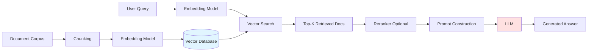

# RAG Systems (Retrieval-Augmented Generation)

## Table of Contents
1. [RAG Architecture Overview](#rag-architecture-overview)
2. [Embedding Models](#embedding-models)
3. [Vector Databases](#vector-databases)
4. [Chunking Strategies](#chunking-strategies)
5. [Retrieval Methods](#retrieval-methods)
6. [Reranking](#reranking)
7. [System Design](#system-design)
8. [Interview Insights](#interview-insights)

---

## RAG Architecture Overview

### What is RAG?

**Problem**: LLMs have limited context windows and can hallucinate or lack domain-specific knowledge.

**Solution**: Augment LLM with external knowledge retrieved from a database.

### High-Level Pipeline



### Complete RAG Flow (ASCII)

```
INDEXING PHASE (Offline)
═══════════════════════
Documents → Chunking → Embedding → Vector DB
                                      ↓
                              [Store: vectors + metadata]

RETRIEVAL PHASE (Online)
═══════════════════════
User Query
   ↓
Embedding Model → Query Vector [768-dim]
   ↓
Vector Database Search (Cosine Similarity)
   ↓
Top-K Most Similar Chunks (k=5-10)
   ↓
[Optional] Reranking (Cross-encoder)
   ↓
Context Construction
   ↓
Prompt: "Given context: {chunks}\nAnswer: {query}"
   ↓
LLM Generation
   ↓
Answer + Citations
```

### Basic RAG Implementation

```python
def rag_pipeline(query, vector_db, llm, k=5):
    """
    Simple RAG pipeline
    """
    # 1. Embed query
    query_embedding = embed_model(query)  # [768]
    
    # 2. Retrieve similar documents
    results = vector_db.similarity_search(
        query_embedding, 
        top_k=k
    )  # Returns: [(doc, score), ...]
    
    # 3. Extract chunks
    context_chunks = [doc.content for doc, score in results]
    
    # 4. Construct prompt
    context = "\n\n".join(context_chunks)
    prompt = f"""Use the following context to answer the question.
    
Context:
{context}

Question: {query}

Answer:"""
    
    # 5. Generate answer
    answer = llm.generate(prompt)
    
    return answer, results  # Return answer + sources
```

---

## Embedding Models

### What are Embeddings?

**Goal**: Map text to dense vector representations where semantic similarity → geometric proximity.

**Example**:
```
"dog"     → [0.2, 0.8, 0.1, ...]
"puppy"   → [0.3, 0.7, 0.2, ...]  ← Similar vector
"car"     → [0.9, 0.1, 0.8, ...]  ← Different vector
```

### Popular Embedding Models

| Model | Dimension | Performance | Use Case |
|-------|-----------|-------------|----------|
| **OpenAI text-embedding-3-large** | 3072 | Excellent | Production |
| **OpenAI text-embedding-3-small** | 1536 | Good | Cost-efficient |
| **Cohere embed-v3** | 1024 | Excellent | Multilingual |
| **sentence-transformers/all-MiniLM-L6-v2** | 384 | Moderate | Self-hosted |
| **BAAI/bge-large-en-v1.5** | 1024 | Excellent | Self-hosted |

### Embedding Quality Metrics

**MTEB Benchmark** (Massive Text Embedding Benchmark):
- Measures retrieval, clustering, classification performance
- Top models: 70-80% accuracy across tasks

### Key Considerations

#### 1. Dimension Trade-offs

Higher dimensions:
- ✅ More expressive
- ✅ Better retrieval accuracy
- ❌ More storage (3072 × 4 bytes = 12KB per vector)
- ❌ Slower search

#### 2. Context Length

Most embedding models have max input length:
- **512 tokens**: Older models (BERT-based)
- **8192 tokens**: Modern models (OpenAI ada-002)
- **Chunking required** if documents exceed limit

#### 3. Domain Adaptation

**Problem**: General embeddings may not capture domain-specific semantics.

**Solutions**:
- Fine-tune on domain data
- Use domain-specific models (e.g., BioBERT for medical)
- Synthetic data generation for fine-tuning

### How Embeddings are Created

**Modern approach**: Contrastive learning

```python
def train_embedding_model(positive_pairs, negative_pairs):
    """
    Positive pairs: (query, relevant_doc)
    Negative pairs: (query, irrelevant_doc)
    """
    for query, pos_doc, neg_doc in training_data:
        # Embed all
        q_emb = model.encode(query)
        pos_emb = model.encode(pos_doc)
        neg_emb = model.encode(neg_doc)
        
        # Contrastive loss: maximize similarity with positive,
        # minimize with negative
        loss = max(0, margin - cosine_sim(q_emb, pos_emb) 
                          + cosine_sim(q_emb, neg_emb))
        
        loss.backward()
        optimizer.step()
```

**Loss Function** (InfoNCE):

$$\mathcal{L} = -\log \frac{\exp(\text{sim}(q, d^+) / \tau)}{\exp(\text{sim}(q, d^+) / \tau) + \sum_{d^-} \exp(\text{sim}(q, d^-) / \tau)}$$

Where:
- $q$ = query embedding
- $d^+$ = positive document
- $d^-$ = negative documents
- $\tau$ = temperature parameter

---

## Vector Databases

### Why Not Regular Databases?

**Problem**: Finding similar vectors requires comparing against millions of vectors.

**Naive approach**: O(n·d) where n=database size, d=dimension → Too slow!

**Solution**: Approximate Nearest Neighbor (ANN) algorithms.

### Popular Vector Databases

| Database | Type | Index | Best For |
|----------|------|-------|----------|
| **FAISS** | Library | HNSW, IVF | High-performance |
| **ChromaDB** | Embedded | HNSW | Prototyping |
| **Pinecone** | Cloud | Proprietary | Production SaaS |
| **Weaviate** | Self-hosted | HNSW | Feature-rich |
| **Milvus** | Distributed | Multiple | Large scale |
| **Qdrant** | Self-hosted | HNSW | Rust performance |

### FAISS (Facebook AI Similarity Search)

#### Index Types

**1. Flat (Exact Search)**
```python
import faiss

# Create exact index
dimension = 768
index = faiss.IndexFlatL2(dimension)  # L2 distance

# Add vectors
vectors = np.random.random((10000, dimension)).astype('float32')
index.add(vectors)

# Search
query = np.random.random((1, dimension)).astype('float32')
distances, indices = index.search(query, k=10)
```
- **Complexity**: O(n·d)
- **Use**: Small datasets (<100K vectors)

**2. IVF (Inverted File Index)**

Concept: Cluster vectors, then search only relevant clusters.

```
Training Phase:
1. Cluster vectors into K groups (K-means)
2. Assign each vector to nearest cluster

Search Phase:
1. Find nearest clusters to query (nprobe clusters)
2. Search only within those clusters
```

```python
# Create IVF index
nlist = 100  # Number of clusters
quantizer = faiss.IndexFlatL2(dimension)
index = faiss.IndexIVFFlat(quantizer, dimension, nlist)

# Train
index.train(vectors)
index.add(vectors)

# Search (only search 10 nearest clusters)
index.nprobe = 10
distances, indices = index.search(query, k=10)
```
- **Complexity**: O(√n·d) approximately
- **Trade-off**: Speed vs accuracy (controlled by nprobe)

**3. HNSW (Hierarchical Navigable Small World)**

**Key Idea**: Multi-layer graph structure.

```
Layer 2:  A -------- F -------- K     (Sparse, long jumps)
           |          |          |
Layer 1:  A -- B -- F -- H -- K      (Medium density)
           |   |    |   |    |   |
Layer 0:  A-B-C-D-E-F-G-H-I-J-K      (Dense, all nodes)
```

**Search Process**:
1. Start at top layer
2. Greedily move to closer nodes
3. Drop to lower layer
4. Repeat until bottom layer

```python
# Create HNSW index
M = 32  # Number of connections per layer
index = faiss.IndexHNSWFlat(dimension, M)

# Add vectors (no training needed)
index.add(vectors)

# Search
distances, indices = index.search(query, k=10)
```
- **Complexity**: O(log(n)·d)
- **Best**: High-dimensional data
- **Trade-off**: Memory usage (stores graph)

### Similarity Metrics

**1. Cosine Similarity**

$$\text{sim}(a, b) = \frac{a \cdot b}{\|a\| \|b\|} = \frac{\sum a_i b_i}{\sqrt{\sum a_i^2} \sqrt{\sum b_i^2}}$$

Range: [-1, 1], where 1 = identical direction

**Use**: Most common for embeddings (direction matters, not magnitude)

```python
def cosine_similarity(a, b):
    return np.dot(a, b) / (np.linalg.norm(a) * np.linalg.norm(b))
```

**2. Euclidean Distance (L2)**

$$d(a, b) = \sqrt{\sum (a_i - b_i)^2}$$

**Use**: When magnitude matters

**3. Dot Product**

$$\text{sim}(a, b) = \sum a_i b_i$$

**Use**: Fast, works if embeddings are normalized

### ChromaDB Architecture

```python
import chromadb

# Initialize
client = chromadb.Client()
collection = client.create_collection(
    name="documents",
    metadata={"hnsw:space": "cosine"}  # Similarity metric
)

# Add documents
collection.add(
    documents=["Document 1", "Document 2"],
    embeddings=[[0.1, 0.2, ...], [0.3, 0.4, ...]],
    metadatas=[{"source": "file1.txt"}, {"source": "file2.txt"}],
    ids=["doc1", "doc2"]
)

# Query
results = collection.query(
    query_embeddings=[[0.15, 0.25, ...]],
    n_results=10,
    where={"source": "file1.txt"}  # Metadata filtering
)
```

**Features**:
- Built-in embedding (uses sentence-transformers by default)
- Persistent storage (SQLite + custom HNSW)
- Metadata filtering

---

## Chunking Strategies

### Why Chunk?

**Problems with whole documents**:
1. Exceed embedding model's context limit
2. Dilute relevance (one sentence relevant, rest noise)
3. Exceed LLM's context window

**Goal**: Balance between context and specificity.

### Chunking Methods

#### 1. Fixed-Size Chunking

**Method**: Split by character/token count with overlap.

```python
def fixed_size_chunking(text, chunk_size=500, overlap=50):
    """
    chunk_size: characters per chunk
    overlap: characters to overlap between chunks
    """
    chunks = []
    start = 0
    
    while start < len(text):
        end = start + chunk_size
        chunk = text[start:end]
        chunks.append(chunk)
        start += (chunk_size - overlap)
    
    return chunks
```

**Pros**: Simple, consistent chunk sizes  
**Cons**: May split sentences/paragraphs awkwardly

**Example**:
```
Text: "The transformer architecture revolutionized NLP. It uses self-attention..."

Chunk 1: "The transformer architecture revolutionized NLP. It uses"
Chunk 2: "It uses self-attention mechanisms to process..."
         ↑ Overlap preserves context
```

#### 2. Semantic Chunking

**Method**: Split at natural boundaries (sentences, paragraphs).

```python
def semantic_chunking(text, max_chunk_size=500):
    """
    Split by sentences, group into chunks
    """
    sentences = split_into_sentences(text)  # NLP library
    chunks = []
    current_chunk = []
    current_size = 0
    
    for sentence in sentences:
        sentence_size = len(sentence)
        
        if current_size + sentence_size > max_chunk_size and current_chunk:
            # Save current chunk
            chunks.append(" ".join(current_chunk))
            current_chunk = []
            current_size = 0
        
        current_chunk.append(sentence)
        current_size += sentence_size
    
    if current_chunk:
        chunks.append(" ".join(current_chunk))
    
    return chunks
```

**Pros**: Preserves semantic boundaries  
**Cons**: Variable chunk sizes

#### 3. Recursive Chunking

**Method**: Hierarchical splitting (document → sections → paragraphs → sentences).

```python
def recursive_chunking(text, max_size=500):
    """
    Try splitting by decreasing granularity
    """
    # Try splitting by sections first
    sections = text.split("\n\n\n")  # Triple newline
    
    if all(len(s) <= max_size for s in sections):
        return sections
    
    # Split sections by paragraphs
    chunks = []
    for section in sections:
        paragraphs = section.split("\n\n")
        
        for para in paragraphs:
            if len(para) <= max_size:
                chunks.append(para)
            else:
                # Further split by sentences
                chunks.extend(semantic_chunking(para, max_size))
    
    return chunks
```

**Pros**: Respects document structure  
**Cons**: More complex

#### 4. Agentic Chunking

**Method**: Use LLM to determine chunk boundaries based on topic shifts.

```python
def agentic_chunking(text, llm):
    """
    Use LLM to identify semantic boundaries
    """
    prompt = f"""Analyze this text and identify natural topic boundaries.
    Output line numbers where topics change.
    
    Text:
    {text}
    """
    
    boundaries = llm.generate(prompt)  # Returns: [0, 145, 289, ...]
    
    chunks = []
    for i in range(len(boundaries) - 1):
        start = boundaries[i]
        end = boundaries[i + 1]
        chunks.append(text[start:end])
    
    return chunks
```

**Pros**: Intelligent, topic-aware  
**Cons**: Expensive (LLM calls), slower

### Chunking Best Practices

| Document Type | Recommended Strategy | Chunk Size | Overlap |
|---------------|---------------------|------------|---------|
| Technical docs | Recursive (by headers) | 800-1000 | 100 |
| Books | Semantic (by paragraphs) | 500-700 | 50 |
| Code | Recursive (by functions) | 300-500 | 50 |
| Chat logs | Fixed-size | 300-400 | 50 |
| Legal docs | Semantic (by sections) | 1000-1500 | 200 |

### Metadata Enrichment

**Add context to chunks**:

```python
def create_chunk_with_metadata(chunk, doc_metadata):
    return {
        "content": chunk,
        "metadata": {
            "source": doc_metadata["filename"],
            "chunk_id": chunk_index,
            "doc_title": doc_metadata["title"],
            "section": extract_section_name(chunk),
            "chunk_size": len(chunk),
            "timestamp": datetime.now()
        }
    }
```

**Benefits**:
- Filtering during retrieval
- Citation in answers
- Debugging retrieval issues

---

## Retrieval Methods

### 1. Dense Retrieval (Semantic Search)

**Method**: Embed query and documents, find nearest neighbors.

```python
def dense_retrieval(query, vector_db, k=10):
    query_emb = embed_model(query)
    results = vector_db.search(query_emb, top_k=k)
    return results
```

**Pros**: Captures semantic similarity  
**Cons**: May miss exact keyword matches

**Example**:
```
Query: "How to train neural networks?"
Retrieved: "Deep learning model training procedures..."
           ✅ Semantically similar
```

### 2. Sparse Retrieval (Keyword Search)

**Method**: BM25 or TF-IDF based on term overlap.

**BM25 Formula**:

$$\text{score}(D, Q) = \sum_{t \in Q} \text{IDF}(t) \cdot \frac{f(t, D) \cdot (k_1 + 1)}{f(t, D) + k_1 \cdot (1 - b + b \cdot \frac{|D|}{\text{avgdl}})}$$

Where:
- $f(t, D)$ = term frequency in document
- $|D|$ = document length
- $\text{avgdl}$ = average document length
- $k_1, b$ = tuning parameters

```python
from rank_bm25 import BM25Okapi

def sparse_retrieval(query, documents, k=10):
    # Tokenize documents
    tokenized_docs = [doc.split() for doc in documents]
    
    # Build BM25 index
    bm25 = BM25Okapi(tokenized_docs)
    
    # Query
    tokenized_query = query.split()
    scores = bm25.get_scores(tokenized_query)
    
    # Top-K
    top_k_indices = np.argsort(scores)[-k:][::-1]
    return [documents[i] for i in top_k_indices]
```

**Pros**: Exact keyword matches  
**Cons**: Ignores semantics

### 3. Hybrid Retrieval

**Method**: Combine dense and sparse retrieval.

```
Hybrid Score = α × Dense_Score + (1-α) × Sparse_Score
```

```python
def hybrid_retrieval(query, vector_db, documents, alpha=0.7, k=10):
    # Dense retrieval
    dense_results = dense_retrieval(query, vector_db, k=20)
    dense_scores = {doc.id: score for doc, score in dense_results}
    
    # Sparse retrieval
    sparse_results = sparse_retrieval(query, documents, k=20)
    sparse_scores = {doc.id: score for doc, score in sparse_results}
    
    # Combine scores (normalize first)
    dense_norm = normalize_scores(dense_scores)
    sparse_norm = normalize_scores(sparse_scores)
    
    hybrid_scores = {}
    all_doc_ids = set(dense_scores.keys()) | set(sparse_scores.keys())
    
    for doc_id in all_doc_ids:
        d_score = dense_norm.get(doc_id, 0)
        s_score = sparse_norm.get(doc_id, 0)
        hybrid_scores[doc_id] = alpha * d_score + (1 - alpha) * s_score
    
    # Top-K
    top_k = sorted(hybrid_scores.items(), key=lambda x: x[1], reverse=True)[:k]
    return top_k
```

**Best of both worlds**: Semantic understanding + exact matches

**Example**:
```
Query: "What is the capital of France?"
Dense: "Paris is located in France..." (0.85)
Sparse: "The capital city is Paris..." (0.92) ← Keyword "capital"
Hybrid: Combines both signals
```

### 4. Query Expansion

**Method**: Expand query with synonyms or related terms.

```python
def query_expansion(query, llm):
    prompt = f"""Generate 3 alternative phrasings of this query:
    
    Original: {query}
    
    Alternatives:"""
    
    alternatives = llm.generate(prompt).split("\n")
    
    # Retrieve with all queries
    all_results = []
    for alt_query in [query] + alternatives:
        results = dense_retrieval(alt_query, vector_db, k=5)
        all_results.extend(results)
    
    # Deduplicate and re-rank
    return deduplicate(all_results)
```

---

## Reranking

### Why Rerank?

**Problem**: Initial retrieval casts wide net, may include irrelevant results.

**Solution**: Use more sophisticated model to reorder top results.

### Reranking Pipeline

```
Initial Retrieval (Bi-encoder)
   ↓
Top 100 candidates (fast, approximate)
   ↓
Reranking (Cross-encoder)
   ↓
Top 10 refined results (slow, accurate)
```

### Bi-encoder vs Cross-encoder

**Bi-encoder** (used in retrieval):
```
Query → Encoder → Vector
Doc   → Encoder → Vector
         ↓
    Cosine Similarity
```
- **Pros**: Precompute doc embeddings, fast search
- **Cons**: Query and doc encoded independently

**Cross-encoder** (used in reranking):
```
[Query, Doc] → Joint Encoder → Relevance Score
```
- **Pros**: Captures query-doc interactions
- **Cons**: Can't precompute, must run for each pair

### Reranking Implementation

```python
from sentence_transformers import CrossEncoder

def rerank_results(query, initial_results, top_k=10):
    """
    initial_results: List of (doc, score) from retrieval
    """
    # Load cross-encoder
    reranker = CrossEncoder('cross-encoder/ms-marco-MiniLM-L-6-v2')
    
    # Prepare pairs
    pairs = [(query, doc.content) for doc, _ in initial_results]
    
    # Compute relevance scores
    rerank_scores = reranker.predict(pairs)
    
    # Sort by new scores
    results_with_scores = list(zip(initial_results, rerank_scores))
    results_with_scores.sort(key=lambda x: x[1], reverse=True)
    
    # Return top-K
    return results_with_scores[:top_k]
```

### Popular Reranking Models

| Model | Size | Speed | Use Case |
|-------|------|-------|----------|
| **Cohere rerank-v3** | API | Fast | Production |
| **cross-encoder/ms-marco-MiniLM** | Small | Fast | Self-hosted |
| **cross-encoder/ms-marco-DistilBERT** | Medium | Medium | Balanced |
| **cross-encoder/ms-marco-electra-base** | Large | Slow | High accuracy |

---

## System Design

### Production RAG Architecture

```
                    Load Balancer
                          ↓
        ┌─────────────────┼─────────────────┐
        ↓                 ↓                 ↓
   API Server 1     API Server 2     API Server N
        ↓                                   
   ┌────────────────────────────────────┐
   │        Retrieval Service           │
   │  ┌──────────────────────────────┐  │
   │  │  Query Processing            │  │
   │  │  • Embedding                 │  │
   │  │  • Query expansion           │  │
   │  └──────────────────────────────┘  │
   │             ↓                      │
   │  ┌──────────────────────────────┐  │
   │  │  Vector Search               │  │
   │  │  • FAISS/Pinecone            │  │
   │  │  • Top-K retrieval           │  │
   │  └──────────────────────────────┘  │
   │             ↓                      │
   │  ┌──────────────────────────────┐  │
   │  │  Reranking (Optional)        │  │
   │  │  • Cross-encoder             │  │
   │  └──────────────────────────────┘  │
   └────────────────────────────────────┘
                ↓
   ┌────────────────────────────────────┐
   │        LLM Service                 │
   │  • Prompt construction             │
   │  • Generation                      │
   │  • Response formatting             │
   └────────────────────────────────────┘
                ↓
            Response
```

### Key Design Decisions

#### 1. Indexing Strategy

**Batch Processing**:
```python
def index_documents_batch(documents, batch_size=100):
    for i in range(0, len(documents), batch_size):
        batch = documents[i:i+batch_size]
        
        # Chunk
        chunks = [chunk_document(doc) for doc in batch]
        
        # Embed
        embeddings = embed_model.encode(chunks)
        
        # Store
        vector_db.add(
            embeddings=embeddings,
            documents=chunks,
            metadatas=[doc.metadata for doc in batch]
        )
```

**Incremental Updates**:
```python
def update_document(doc_id, new_content):
    # Remove old vectors
    vector_db.delete(filter={"doc_id": doc_id})
    
    # Add new vectors
    chunks = chunk_document(new_content)
    embeddings = embed_model.encode(chunks)
    vector_db.add(embeddings, chunks, metadata={"doc_id": doc_id})
```

#### 2. Caching Strategy

**Query Cache**:
```python
from functools import lru_cache

@lru_cache(maxsize=1000)
def cached_retrieval(query_hash):
    return retrieval_function(query)

def retrieve_with_cache(query):
    query_hash = hash(query)
    return cached_retrieval(query_hash)
```

**Embedding Cache**:
```python
# Cache embeddings for common queries
embedding_cache = {}

def get_embedding(text):
    if text in embedding_cache:
        return embedding_cache[text]
    
    emb = embed_model.encode(text)
    embedding_cache[text] = emb
    return emb
```

#### 3. Scalability

**Sharding**:
```python
# Distribute vectors across shards
def get_shard_id(doc_id, num_shards=10):
    return hash(doc_id) % num_shards

def distributed_search(query, num_shards=10):
    query_emb = embed_model(query)
    
    # Search all shards in parallel
    shard_results = parallel_map(
        lambda shard_id: search_shard(shard_id, query_emb),
        range(num_shards)
    )
    
    # Merge results
    all_results = []
    for results in shard_results:
        all_results.extend(results)
    
    # Global top-K
    all_results.sort(key=lambda x: x.score, reverse=True)
    return all_results[:10]
```

---

## Interview Insights

### Common Questions

**Q1: When would you use RAG vs fine-tuning?**

**Answer**:

| Aspect | RAG | Fine-tuning |
|--------|-----|-------------|
| **Use When** | Knowledge updates frequently | Task-specific behavior |
| **Pros** | No retraining, explainable | Better task performance |
| **Cons** | Retrieval latency | Expensive, can't update knowledge easily |
| **Example** | Documentation Q&A | Sentiment analysis |

**Best**: Combine both! Fine-tune for style, RAG for knowledge.

**Q2: How do you evaluate RAG system performance?**

**Metrics**:
1. **Retrieval Metrics**:
   - Precision@K: % of retrieved docs that are relevant
   - Recall@K: % of relevant docs retrieved
   - MRR (Mean Reciprocal Rank): 1/rank of first relevant doc

2. **Generation Metrics**:
   - Answer relevance (LLM-as-judge)
   - Faithfulness (answer grounded in context?)
   - BLEU/ROUGE (if ground truth answers exist)

3. **End-to-End**:
   - User satisfaction
   - Citation accuracy
   - Latency (p50, p95, p99)

**Q3: Design a RAG system for 10M documents.**

**Answer**:
1. **Indexing**:
   - Distributed vector DB (Milvus, Pinecone)
   - Shard by document type/date
   - Batch embedding generation

2. **Retrieval**:
   - HNSW index for speed
   - Hybrid search (dense + BM25)
   - 2-stage: retrieve 100, rerank to 10

3. **Serving**:
   - Load balanced API servers
   - Query/embedding caching
   - Async processing

4. **Monitoring**:
   - Retrieval quality metrics
   - Latency tracking
   - Cost per query

**Q4: How to handle multi-hop questions?**

**Example**: "Who is the CEO of the company that created ChatGPT?"

**Solution**: Iterative retrieval
```python
def multi_hop_rag(question, max_hops=3):
    context = []
    
    for hop in range(max_hops):
        # Retrieve with current context
        results = retrieve(question, context)
        context.extend(results)
        
        # Check if sufficient to answer
        if llm_can_answer(question, context):
            break
        
        # Generate follow-up query
        question = llm_generate_followup(question, context)
    
    return llm_generate_answer(question, context)
```

### Common Pitfalls

❌ **Not handling chunk boundaries**: Can split important context  
✅ **Solution**: Use overlap or parent-document retrieval

❌ **Ignoring metadata**: Can't filter by source/date  
✅ **Solution**: Enrich chunks with structured metadata

❌ **No reranking**: Initial retrieval not always accurate  
✅ **Solution**: Add cross-encoder reranking step

❌ **Static chunk size**: Different docs need different strategies  
✅ **Solution**: Adaptive chunking based on document type

---

## Key Papers

1. **"Retrieval-Augmented Generation for Knowledge-Intensive NLP Tasks"** (Lewis et al., 2020)
2. **"REALM: Retrieval-Augmented Language Model Pre-Training"** (Guu et al., 2020)
3. **"Efficient and Robust Approximate Nearest Neighbor Search Using HNSW"** (Malkov & Yashunin, 2018)

---

**Next**: [Generative AI →](03-GENERATIVE-AI.md)


