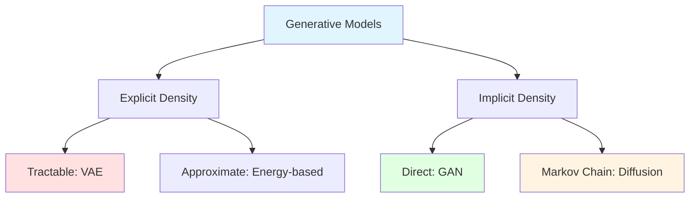

# Generative AI

## Table of Contents
1. [Generative AI Overview](#generative-ai-overview)
2. [Generative Adversarial Networks (GANs)](#generative-adversarial-networks-gans)
3. [Variational Autoencoders (VAEs)](#variational-autoencoders-vaes)
4. [Diffusion Models](#diffusion-models)
5. [Prompt Engineering](#prompt-engineering)
6. [Few-Shot Learning](#few-shot-learning)
7. [Interview Insights](#interview-insights)

---

## Generative AI Overview

### What is Generative AI?

**Definition**: AI systems that create new content (text, images, audio, video) by learning patterns from training data.

**Key Distinction**:
- **Discriminative Models**: P(y|x) - Predict label given input
- **Generative Models**: P(x) or P(x|y) - Model data distribution, generate new samples

### Types of Generative Models



### Application Landscape

| Model Type | Best For | Examples |
|------------|----------|----------|
| **LLMs** | Text generation | GPT-4, Claude, Llama |
| **Diffusion** | Image generation | DALL-E 3, Midjourney, Stable Diffusion |
| **VAEs** | Latent representations | Image compression, anomaly detection |
| **GANs** | High-quality images | StyleGAN, PhotoRealistic faces |
| **Autoregressive** | Sequential data | PixelCNN, WaveNet |

---

## Generative Adversarial Networks (GANs)

### Core Concept

**Two-Player Game**:
- **Generator (G)**: Creates fake data
- **Discriminator (D)**: Distinguishes real from fake

**Goal**: G learns to fool D, D learns to detect fakes

### Architecture

```
Real Data ────────┐
                  ↓
            ┌──────────┐
            │Discrim-  │
Random      │inator D  │──→ Real/Fake
Noise ──→   └──────────┘    Probability
   ↓             ↑
┌──────────┐     │
│Generator │     │
│    G     │─────┘
└──────────┘
  Fake Data
```

### Mathematical Formulation

**Objective** (Minimax game):

$$\min_G \max_D V(D, G) = \mathbb{E}_{x \sim p_{data}}[\log D(x)] + \mathbb{E}_{z \sim p_z}[\log(1 - D(G(z)))]$$

**Interpretation**:
- **Discriminator** maximizes: Correctly classify real as real (log D(x)), fake as fake (log(1-D(G(z))))
- **Generator** minimizes: Fool discriminator (wants D(G(z)) → 1)

### Training Process

```python
def train_gan(generator, discriminator, real_data, epochs):
    for epoch in range(epochs):
        for real_batch in real_data:
            # ═══════════════════════════
            # Train Discriminator
            # ═══════════════════════════
            # Real data
            real_labels = ones(batch_size)
            d_loss_real = binary_cross_entropy(
                discriminator(real_batch), 
                real_labels
            )
            
            # Fake data
            noise = sample_noise(batch_size, latent_dim)
            fake_batch = generator(noise)
            fake_labels = zeros(batch_size)
            d_loss_fake = binary_cross_entropy(
                discriminator(fake_batch.detach()),  # Don't backprop to G
                fake_labels
            )
            
            # Total discriminator loss
            d_loss = d_loss_real + d_loss_fake
            d_loss.backward()
            d_optimizer.step()
            
            # ═══════════════════════════
            # Train Generator
            # ═══════════════════════════
            noise = sample_noise(batch_size, latent_dim)
            fake_batch = generator(noise)
            
            # Generator wants D to classify fakes as real
            g_loss = binary_cross_entropy(
                discriminator(fake_batch),
                real_labels  # Pretend they're real!
            )
            
            g_loss.backward()
            g_optimizer.step()
```

### GAN Variants

#### 1. DCGAN (Deep Convolutional GAN)

**Innovations**:
- Replace pooling with strided convolutions
- Use BatchNorm in both G and D
- Remove fully connected layers
- Use LeakyReLU in D, ReLU in G

```
Generator Architecture:
Input: Random noise z [100]
    ↓
Linear → [4×4×1024]
    ↓
ConvTranspose(stride=2) → [8×8×512] + BatchNorm + ReLU
    ↓
ConvTranspose(stride=2) → [16×16×256] + BatchNorm + ReLU
    ↓
ConvTranspose(stride=2) → [32×32×128] + BatchNorm + ReLU
    ↓
ConvTranspose(stride=2) → [64×64×3] + Tanh
    ↓
Output: RGB Image [64×64×3]
```

#### 2. StyleGAN

**Innovation**: Style-based generator with progressive growing.

**Key Features**:
- **Mapping Network**: z → w (learned latent space)
- **Adaptive Instance Normalization (AdaIN)**: Inject style at each layer
- **Style Mixing**: Combine styles from different latents

```
Mapping Network: z → w
    ↓
Synthesis Network:
    ↓
Constant Input [4×4]
    ↓
AdaIN(w1) → Conv → AdaIN(w1)  [4×4]
    ↓
Upsample [8×8]
    ↓
AdaIN(w2) → Conv → AdaIN(w2)  [8×8]
    ↓
... (Progressive layers)
    ↓
ToRGB → [1024×1024×3]
```

#### 3. Conditional GAN (cGAN)

**Goal**: Control generation with labels.

$$\min_G \max_D V(D, G) = \mathbb{E}_{x}[\log D(x|y)] + \mathbb{E}_{z}[\log(1 - D(G(z|y)))]$$

```python
def conditional_generator(noise, label, num_classes):
    # Embed label
    label_emb = embedding(label)  # [batch, embed_dim]
    
    # Concatenate with noise
    input_vec = concat([noise, label_emb], dim=1)
    
    # Generate
    output = generator_network(input_vec)
    return output

# Usage: Generate image of digit "7"
noise = sample_noise(1, 100)
image = conditional_generator(noise, label=7, num_classes=10)
```

### GAN Challenges

#### 1. Mode Collapse

**Problem**: Generator produces limited variety (e.g., only one digit).

**Solutions**:
- Minibatch discrimination
- Unrolled GAN
- Multiple discriminators

#### 2. Training Instability

**Problem**: Loss oscillates, doesn't converge.

**Solutions**:
- Spectral normalization
- Progressive growing
- Gradient penalty (WGAN-GP)

#### 3. Evaluation

**Metrics**:
- **Inception Score (IS)**: Measures quality and diversity
- **Fréchet Inception Distance (FID)**: Compares generated vs real distribution

$$FID = ||\mu_r - \mu_g||^2 + Tr(\Sigma_r + \Sigma_g - 2\sqrt{\Sigma_r \Sigma_g})$$

Lower FID = better

---

## Variational Autoencoders (VAEs)

### Core Concept

**Goal**: Learn latent representation that captures data distribution.

**Key Innovation**: Force latent space to follow known distribution (Gaussian).

### Architecture

```
Encoder (Recognition Model)
    ↓
Input x → [μ, σ²]  (Latent parameters)
    ↓
Sampling: z ~ N(μ, σ²)  (Reparameterization trick)
    ↓
Decoder (Generative Model)
    ↓
Reconstructed x'
```

### Mathematical Formulation

**Objective**: Maximize Evidence Lower Bound (ELBO)

$$\log p(x) \geq \mathbb{E}_{q_\phi(z|x)}[\log p_\theta(x|z)] - D_{KL}(q_\phi(z|x) || p(z))$$

**Two Terms**:
1. **Reconstruction Loss**: $\mathbb{E}[\log p_\theta(x|z)]$ - How well decoder reconstructs input
2. **KL Divergence**: $D_{KL}(q(z|x) || p(z))$ - How close latent distribution is to prior

**Loss Function**:

$$\mathcal{L} = \underbrace{||x - \hat{x}||^2}_{\text{Reconstruction}} + \underbrace{D_{KL}(q(z|x) || \mathcal{N}(0, I))}_{\text{Regularization}}$$

### Reparameterization Trick

**Problem**: Can't backpropagate through sampling z ~ N(μ, σ²).

**Solution**: Rewrite sampling as deterministic transformation.

$$z = \mu + \sigma \odot \epsilon, \quad \epsilon \sim \mathcal{N}(0, I)$$

Now gradients flow through μ and σ.

```python
def reparameterize(mu, log_var):
    """
    mu: [batch, latent_dim]
    log_var: [batch, latent_dim]
    """
    std = exp(0.5 * log_var)
    eps = random_normal_like(std)
    z = mu + std * eps
    return z
```

### Implementation

```python
class VAE:
    def __init__(self, input_dim, latent_dim):
        # Encoder
        self.encoder = Sequential([
            Linear(input_dim, 512), ReLU(),
            Linear(512, 256), ReLU()
        ])
        self.fc_mu = Linear(256, latent_dim)
        self.fc_logvar = Linear(256, latent_dim)
        
        # Decoder
        self.decoder = Sequential([
            Linear(latent_dim, 256), ReLU(),
            Linear(256, 512), ReLU(),
            Linear(512, input_dim), Sigmoid()
        ])
    
    def encode(self, x):
        h = self.encoder(x)
        mu = self.fc_mu(h)
        log_var = self.fc_logvar(h)
        return mu, log_var
    
    def decode(self, z):
        return self.decoder(z)
    
    def forward(self, x):
        # Encode
        mu, log_var = self.encode(x)
        
        # Reparameterize
        z = reparameterize(mu, log_var)
        
        # Decode
        x_recon = self.decode(z)
        
        return x_recon, mu, log_var
    
    def loss(self, x, x_recon, mu, log_var):
        # Reconstruction loss
        recon_loss = F.binary_cross_entropy(x_recon, x, reduction='sum')
        
        # KL divergence
        # KL(N(μ,σ²) || N(0,I)) = -0.5 * Σ(1 + log(σ²) - μ² - σ²)
        kl_loss = -0.5 * sum(1 + log_var - mu**2 - exp(log_var))
        
        return recon_loss + kl_loss
```

### β-VAE

**Enhancement**: Control trade-off between reconstruction and latent regularization.

$$\mathcal{L} = \mathbb{E}[\log p(x|z)] - \beta \cdot D_{KL}(q(z|x) || p(z))$$

- $\beta > 1$: Encourage disentangled representations
- $\beta < 1$: Better reconstruction

### VAE vs GAN

| Aspect | VAE | GAN |
|--------|-----|-----|
| **Training** | Stable | Unstable |
| **Image Quality** | Blurry | Sharp |
| **Latent Space** | Continuous, structured | Less structured |
| **Likelihood** | Tractable | Intractable |
| **Use Case** | Representation learning | High-quality generation |

---

## Diffusion Models

### Core Concept

**Forward Process**: Gradually add noise to data until it becomes pure noise.

**Reverse Process**: Learn to denoise, going from noise → data.

### Process Visualization

```
Forward Diffusion (Fixed)
x₀ → x₁ → x₂ → ... → xₜ → ... → x_T
📸   🌫️   🌫️🌫️        🌫️🌫️🌫️      ❄️
Data                              Noise

Reverse Diffusion (Learned)
x_T ← x_{T-1} ← ... ← x₁ ← x₀
❄️                           📸
Noise      Denoising        Data
```

### Mathematical Formulation

#### Forward Process

Add Gaussian noise at each timestep:

$$q(x_t | x_{t-1}) = \mathcal{N}(x_t; \sqrt{1-\beta_t} x_{t-1}, \beta_t I)$$

Where $\beta_t$ is noise schedule (increases over time).

**Closed-form** (sample $x_t$ directly from $x_0$):

$$q(x_t | x_0) = \mathcal{N}(x_t; \sqrt{\bar{\alpha}_t} x_0, (1 - \bar{\alpha}_t) I)$$

Where $\bar{\alpha}_t = \prod_{s=1}^t (1 - \beta_s)$

#### Reverse Process

Learn to predict noise:

$$p_\theta(x_{t-1} | x_t) = \mathcal{N}(x_{t-1}; \mu_\theta(x_t, t), \Sigma_\theta(x_t, t))$$

### Training Objective

**Goal**: Predict noise $\epsilon$ added at each step.

$$\mathcal{L} = \mathbb{E}_{t, x_0, \epsilon}[||\epsilon - \epsilon_\theta(x_t, t)||^2]$$

Where:
- $\epsilon \sim \mathcal{N}(0, I)$ is true noise
- $\epsilon_\theta(x_t, t)$ is predicted noise
- $x_t = \sqrt{\bar{\alpha}_t} x_0 + \sqrt{1 - \bar{\alpha}_t} \epsilon$

### Algorithm

**Training**:
```python
def train_diffusion_model(model, data, T=1000):
    for x0 in data:
        # Sample random timestep
        t = random_int(1, T)
        
        # Sample noise
        epsilon = random_normal_like(x0)
        
        # Compute noisy image
        alpha_bar_t = get_alpha_bar(t)
        xt = sqrt(alpha_bar_t) * x0 + sqrt(1 - alpha_bar_t) * epsilon
        
        # Predict noise
        epsilon_pred = model(xt, t)
        
        # Compute loss
        loss = mse_loss(epsilon_pred, epsilon)
        
        # Update model
        loss.backward()
        optimizer.step()
```

**Sampling** (Generation):
```python
def sample_diffusion(model, shape, T=1000):
    # Start from pure noise
    xT = random_normal(shape)
    
    x = xT
    for t in reversed(range(1, T+1)):
        # Predict noise
        epsilon_pred = model(x, t)
        
        # Compute mean
        alpha_t = get_alpha(t)
        alpha_bar_t = get_alpha_bar(t)
        
        mu = (1 / sqrt(alpha_t)) * (
            x - ((1 - alpha_t) / sqrt(1 - alpha_bar_t)) * epsilon_pred
        )
        
        # Add noise (except last step)
        if t > 1:
            sigma = sqrt(get_beta(t))
            z = random_normal_like(x)
            x = mu + sigma * z
        else:
            x = mu
    
    return x  # x0
```

### U-Net Architecture (for Diffusion)

```
Input: Noisy Image xᵢ + Timestep embedding t

Encoder (Downsampling):
64×64   → Conv + Attn → 64×64 ──┐
  ↓                              │
32×32   → Conv + Attn → 32×32 ──┼──┐
  ↓                              │  │
16×16   → Conv + Attn → 16×16 ──┼──┼──┐
  ↓                              │  │  │
Bottleneck: 8×8                  │  │  │
  ↓                              │  │  │
Decoder (Upsampling):            │  │  │
16×16   ← ConvTranspose ←────────┘  │  │
  ↓        + Skip connection         │  │
32×32   ← ConvTranspose ←────────────┘  │
  ↓        + Skip connection             │
64×64   ← ConvTranspose ←────────────────┘
  ↓
Output: Predicted Noise ε
```

**Key Components**:
- **Skip Connections**: Preserve fine details
- **Self-Attention**: Capture long-range dependencies
- **Timestep Embedding**: Condition on noise level

### DDPM vs DDIM

| Aspect | DDPM | DDIM |
|--------|------|------|
| **Sampling Steps** | 1000 | 50-100 |
| **Speed** | Slow | Fast |
| **Quality** | Excellent | Good |
| **Deterministic** | No (stochastic) | Yes (can be) |

### Classifier-Free Guidance

**Goal**: Control generation without separate classifier.

**Method**: Train model on both conditional and unconditional objectives.

$$\epsilon_\theta(x_t, t, c) = \epsilon_\theta(x_t, t, \emptyset) + s \cdot (\epsilon_\theta(x_t, t, c) - \epsilon_\theta(x_t, t, \emptyset))$$

Where:
- $c$ = condition (e.g., text prompt)
- $s$ = guidance scale (typically 7-15)
- Higher $s$ = stronger adherence to prompt

```python
def classifier_free_guidance(model, xt, t, condition, guidance_scale):
    # Unconditional prediction
    eps_uncond = model(xt, t, condition=None)
    
    # Conditional prediction
    eps_cond = model(xt, t, condition=condition)
    
    # Guided prediction
    eps = eps_uncond + guidance_scale * (eps_cond - eps_uncond)
    
    return eps
```

---

## Prompt Engineering

### What is Prompt Engineering?

**Definition**: Crafting inputs to LLMs to elicit desired outputs.

### Prompt Components

```
┌─────────────────────────────────────┐
│ System Message (Role)               │  ← Define behavior
├─────────────────────────────────────┤
│ Context / Background                │  ← Provide information
├─────────────────────────────────────┤
│ Instructions                        │  ← What to do
├─────────────────────────────────────┤
│ Examples (Few-shot)                 │  ← Show desired format
├─────────────────────────────────────┤
│ Input / Query                       │  ← Actual question
├─────────────────────────────────────┤
│ Output Format Specification         │  ← Structure response
└─────────────────────────────────────┘
```

### Prompting Techniques

#### 1. Zero-Shot Prompting

**Direct instruction** without examples.

```
Prompt: "Classify the sentiment of this review: 'The movie was boring.'"

Output: "Negative"
```

#### 2. Few-Shot Prompting

**Provide examples** to guide model.

```
Prompt: "Classify sentiment as Positive, Negative, or Neutral.

Review: 'Amazing film!' → Positive
Review: 'It was okay.' → Neutral
Review: 'Terrible waste of time.' → Negative
Review: 'Best movie I've seen in years.' → ?"

Output: "Positive"
```

#### 3. Chain-of-Thought (CoT)

**Show reasoning process**.

```
Prompt: "Q: Roger has 5 tennis balls. He buys 2 more cans of tennis balls. 
Each can has 3 balls. How many tennis balls does he have now?

A: Let's think step by step.
- Roger starts with 5 balls.
- He buys 2 cans, each with 3 balls.
- 2 cans × 3 balls = 6 balls.
- Total: 5 + 6 = 11 balls.

Q: A juggler has 16 balls. Half are golf balls. She loses 4 golf balls. 
How many golf balls does she have now?

A: Let's think step by step."

Output: "- She starts with 16 balls.
- Half are golf balls: 16 ÷ 2 = 8 golf balls.
- She loses 4 golf balls.
- Remaining: 8 - 4 = 4 golf balls."
```

#### 4. Self-Consistency

**Generate multiple reasoning paths**, pick most common answer.

```python
def self_consistency(prompt, model, num_samples=5):
    answers = []
    
    for _ in range(num_samples):
        # Generate with temperature > 0 for diversity
        response = model.generate(prompt, temperature=0.7)
        answer = extract_answer(response)
        answers.append(answer)
    
    # Majority vote
    return most_common(answers)
```

#### 5. ReAct (Reasoning + Acting)

**Interleave** reasoning and actions.

```
Prompt: "Question: What is the capital of the country where BERT was developed?

Thought 1: I need to find out where BERT was developed.
Action 1: Search[BERT development location]
Observation 1: BERT was developed by Google.

Thought 2: Google is headquartered in the United States.
Action 2: Search[United States capital]
Observation 2: The capital of the United States is Washington, D.C.

Thought 3: I now know the answer.
Answer: Washington, D.C."
```

### Prompt Optimization Tips

#### Best Practices

✅ **Be Specific**: "Write a 200-word summary" > "Summarize this"

✅ **Use Delimiters**: Separate sections with ### or """ 

✅ **Specify Format**: "Output as JSON" or "List with bullet points"

✅ **Give Examples**: Show desired input-output pairs

✅ **Add Constraints**: "Without using technical jargon"

#### Common Mistakes

❌ **Vague Instructions**: "Make it better"

❌ **Ambiguous Pronouns**: "Explain why it is important"

❌ **Missing Context**: Not providing necessary background

❌ **Conflicting Instructions**: "Be brief but comprehensive"

### Advanced Techniques

#### 1. System Prompts

```python
system_prompt = """You are an expert Python programmer.
- Write clean, efficient code
- Include docstrings
- Follow PEP 8 style guide
- Add error handling"""

user_prompt = "Write a function to merge two sorted lists."

response = llm.chat([
    {"role": "system", "content": system_prompt},
    {"role": "user", "content": user_prompt}
])
```

#### 2. Prompt Chaining

Break complex tasks into steps.

```python
def prompt_chain(question):
    # Step 1: Extract key entities
    entities = llm("Extract entities from: " + question)
    
    # Step 2: Retrieve info for each entity
    info = []
    for entity in entities:
        info.append(llm(f"What is {entity}?"))
    
    # Step 3: Synthesize answer
    context = "\n".join(info)
    answer = llm(f"Given:\n{context}\n\nAnswer: {question}")
    
    return answer
```

#### 3. Structured Output

```
Prompt: "Extract information and output as JSON.

Text: 'John Smith, 30 years old, works as a Software Engineer at Google.'

Output format:
{
  "name": "...",
  "age": ...,
  "occupation": "...",
  "company": "..."
}"

Output: {
  "name": "John Smith",
  "age": 30,
  "occupation": "Software Engineer",
  "company": "Google"
}
```

---

## Few-Shot Learning

### Definition

**Learning from few examples** (2-10) rather than thousands.

### In-Context Learning

LLMs can learn new tasks from examples **without parameter updates**.

**How It Works**:
1. Prefix prompt with examples
2. Model conditions on examples
3. Generalizes pattern to new input

```python
def few_shot_classification(train_examples, test_input):
    prompt = "Classify the following:\n\n"
    
    # Add examples
    for text, label in train_examples:
        prompt += f"Text: {text}\nLabel: {label}\n\n"
    
    # Add test input
    prompt += f"Text: {test_input}\nLabel:"
    
    return llm.generate(prompt)

# Usage
examples = [
    ("The product is amazing!", "Positive"),
    ("Worst purchase ever.", "Negative"),
    ("It's okay, nothing special.", "Neutral")
]

result = few_shot_classification(examples, "I love this!")
# Output: "Positive"
```

### Meta-Learning (MAML)

**Model-Agnostic Meta-Learning**: Learn initialization that adapts quickly.

**Algorithm**:
```python
def maml(tasks, model, inner_lr, outer_lr):
    """
    tasks: List of few-shot tasks
    """
    meta_optimizer = Adam(model.parameters(), lr=outer_lr)
    
    for task in tasks:
        # Clone model
        adapted_model = clone(model)
        
        # Inner loop: Adapt to task with few examples
        for step in range(k_inner_steps):
            loss = compute_loss(adapted_model, task.train_data)
            adapted_model.update(loss, lr=inner_lr)
        
        # Outer loop: Update meta-model
        meta_loss = compute_loss(adapted_model, task.test_data)
        meta_loss.backward()  # Backprop through inner loop!
    
    meta_optimizer.step()
```

---

## Interview Insights

### Common Questions

**Q1: Compare GANs, VAEs, and Diffusion Models.**

| Aspect | GAN | VAE | Diffusion |
|--------|-----|-----|-----------|
| **Quality** | High | Medium (blurry) | Highest |
| **Training** | Unstable | Stable | Stable |
| **Speed** | Fast | Fast | Slow (many steps) |
| **Likelihood** | No | Yes | Yes (tractable) |
| **Best For** | Images | Representation | State-of-the-art images |

**Q2: How do diffusion models work?**

**Answer**: 
1. Forward process adds Gaussian noise gradually (T steps)
2. Reverse process learns to denoise using U-Net
3. Training: Predict noise at random timesteps
4. Sampling: Start from noise, iteratively denoise
5. Key advantage: Stable training, high quality

**Q3: What is classifier-free guidance?**

**Answer**: Technique to control generation strength without separate classifier. Model trained on both conditional and unconditional. At inference, interpolate between predictions with guidance scale. Higher scale = stronger prompt adherence.

### Common Pitfalls

❌ **Confusing VAE and AE**: VAE has probabilistic latent space with KL regularization

❌ **Saying GANs are obsolete**: Still best for certain tasks (e.g., face generation)

❌ **Not mentioning trade-offs**: Always discuss speed vs quality

---

**Next**: [NLP Fundamentals →](04-NLP-FUNDAMENTALS.md)


