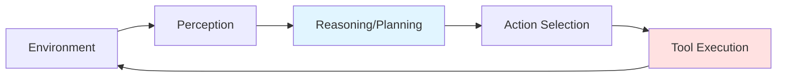

# AI Agents

## Table of Contents
1. [Agent Fundamentals](#agent-fundamentals)
2. [ReAct Framework](#react-framework)
3. [Tool Use](#tool-use)
4. [Planning & Reasoning](#planning--reasoning)
5. [Multi-Agent Systems](#multi-agent-systems)
6. [Agent Frameworks](#agent-frameworks)
7. [Interview Insights](#interview-insights)

---

## Agent Fundamentals

### What is an AI Agent?

**Definition**: An autonomous system that perceives its environment, makes decisions, and takes actions to achieve goals.

**Key Components**:



### Agent Loop

```
┌─────────────────────────────────┐
│         Agent Loop              │
│                                 │
│  1. Observe environment         │
│         ↓                       │
│  2. Think/Reason                │
│         ↓                       │
│  3. Plan action                 │
│         ↓                       │
│  4. Execute action              │
│         ↓                       │
│  5. Update state                │
│         ↓                       │
│  [Repeat until goal achieved]   │
└─────────────────────────────────┘
```

### Types of Agents

| Type | Description | Example |
|------|-------------|---------|
| **Reactive** | Simple stimulus-response | Rule-based chatbot |
| **Deliberative** | Plans before acting | Chess AI |
| **Hybrid** | Combines reactive + deliberative | Autonomous vehicles |
| **Learning** | Improves from experience | RL agents |

---

## ReAct Framework

### Concept

**ReAct** = **Rea**soning + **Act**ing

**Key Idea**: Interleave reasoning traces with action execution.

### Architecture

```
Query: "What's the weather in the capital of France?"

┌────────────────────────────────────────┐
│ Thought 1: I need to find the capital │
│            of France first.            │
└────────────────────────────────────────┘
                 ↓
┌────────────────────────────────────────┐
│ Action 1: Search["capital of France"]  │
└────────────────────────────────────────┘
                 ↓
┌────────────────────────────────────────┐
│ Observation 1: The capital is Paris    │
└────────────────────────────────────────┘
                 ↓
┌────────────────────────────────────────┐
│ Thought 2: Now I need the weather in   │
│            Paris.                      │
└────────────────────────────────────────┘
                 ↓
┌────────────────────────────────────────┐
│ Action 2: Weather["Paris"]             │
└────────────────────────────────────────┘
                 ↓
┌────────────────────────────────────────┐
│ Observation 2: 72°F, partly cloudy     │
└────────────────────────────────────────┘
                 ↓
┌────────────────────────────────────────┐
│ Thought 3: I have the answer.          │
└────────────────────────────────────────┘
                 ↓
┌────────────────────────────────────────┐
│ Answer: The weather in Paris (capital  │
│         of France) is 72°F and partly  │
│         cloudy.                        │
└────────────────────────────────────────┘
```

### Implementation

```python
def react_agent(query, tools, max_iterations=10):
    """
    ReAct agent implementation
    
    tools: Dict of available tools {"search": search_fn, "weather": weather_fn}
    """
    context = []
    
    for iteration in range(max_iterations):
        # === Thought ===
        thought_prompt = f"""
Question: {query}

Previous steps:
{format_context(context)}

What should you do next? Think step by step.
Format: Thought: <your reasoning>
"""
        
        thought = llm.generate(thought_prompt)
        context.append(("Thought", thought))
        print(f"Thought {iteration+1}: {thought}")
        
        # === Action ===
        action_prompt = f"""
Based on your thought: "{thought}"

Available tools: {list(tools.keys())}

What action should you take?
Format: Action: ToolName[argument]
Or: Answer: <final answer>
"""
        
        action_str = llm.generate(action_prompt)
        
        # Check if final answer
        if action_str.startswith("Answer:"):
            answer = action_str.replace("Answer:", "").strip()
            return answer
        
        # Parse action
        tool_name, tool_input = parse_action(action_str)
        context.append(("Action", f"{tool_name}[{tool_input}]"))
        print(f"Action {iteration+1}: {tool_name}[{tool_input}]")
        
        # === Execute ===
        if tool_name not in tools:
            observation = f"Error: Tool '{tool_name}' not found"
        else:
            try:
                observation = tools[tool_name](tool_input)
            except Exception as e:
                observation = f"Error: {str(e)}"
        
        context.append(("Observation", observation))
        print(f"Observation {iteration+1}: {observation}")
        
        # Check if satisfied
        if should_stop(query, context):
            break
    
    # Generate final answer
    final_prompt = f"""
Question: {query}

Steps taken:
{format_context(context)}

Provide the final answer.
"""
    
    answer = llm.generate(final_prompt)
    return answer

def parse_action(action_str):
    """
    Parse 'Search[Paris weather]' into ('Search', 'Paris weather')
    """
    match = re.match(r'Action:\s*(\w+)\[(.*?)\]', action_str)
    if match:
        return match.group(1), match.group(2)
    return None, None
```

### Prompt Engineering for ReAct

**System Prompt**:
```
You are a helpful AI agent that solves problems step-by-step.

For each step:
1. Think: Reason about what to do next
2. Act: Choose a tool and provide input
3. Observe: Examine the tool output
4. Repeat until you can answer

Available tools:
- Search[query]: Search the web
- Calculator[expression]: Evaluate math
- Wikipedia[topic]: Get Wikipedia summary

Format:
Thought: <reasoning>
Action: ToolName[input]
Observation: <tool output>
... (repeat)
Answer: <final answer>
```

---

## Tool Use

### Tool Definition

**Structure**: Each tool needs:
1. **Name**: Identifier
2. **Description**: What it does
3. **Parameters**: Input schema
4. **Function**: Execution logic

### Tool Schema

```python
tools = [
    {
        "name": "search",
        "description": "Search the web for information",
        "parameters": {
            "type": "object",
            "properties": {
                "query": {
                    "type": "string",
                    "description": "The search query"
                }
            },
            "required": ["query"]
        },
        "function": lambda query: web_search(query)
    },
    {
        "name": "calculator",
        "description": "Perform mathematical calculations",
        "parameters": {
            "type": "object",
            "properties": {
                "expression": {
                    "type": "string",
                    "description": "Math expression to evaluate"
                }
            },
            "required": ["expression"]
        },
        "function": lambda expr: eval(expr)
    }
]
```

### Function Calling (OpenAI)

**Modern Approach**: LLM natively outputs structured function calls.

```python
def agent_with_function_calling(query, tools):
    messages = [{"role": "user", "content": query}]
    
    while True:
        # LLM decides which function to call
        response = openai.ChatCompletion.create(
            model="gpt-4",
            messages=messages,
            functions=tools,
            function_call="auto"
        )
        
        message = response.choices[0].message
        
        # Check if function call
        if message.get("function_call"):
            function_name = message["function_call"]["name"]
            function_args = json.loads(message["function_call"]["arguments"])
            
            print(f"Calling: {function_name}({function_args})")
            
            # Execute function
            function_result = execute_function(function_name, function_args)
            
            # Add to conversation
            messages.append(message)
            messages.append({
                "role": "function",
                "name": function_name,
                "content": str(function_result)
            })
        else:
            # Final answer
            return message["content"]
```

**Example Output**:
```json
{
  "function_call": {
    "name": "search",
    "arguments": "{\"query\": \"capital of France\"}"
  }
}
```

### Tool Execution Safety

**Risks**:
- Code execution vulnerabilities
- API abuse
- Resource exhaustion

**Mitigations**:

```python
class SafeToolExecutor:
    def __init__(self, tools, timeout=10, max_calls=20):
        self.tools = tools
        self.timeout = timeout
        self.max_calls = max_calls
        self.call_count = {}
    
    def execute(self, tool_name, args):
        # Rate limiting
        if self.call_count.get(tool_name, 0) >= self.max_calls:
            raise Exception(f"Tool {tool_name} exceeded rate limit")
        
        # Validation
        if tool_name not in self.tools:
            raise Exception(f"Unknown tool: {tool_name}")
        
        tool = self.tools[tool_name]
        
        # Validate arguments
        validate_args(args, tool["parameters"])
        
        # Execute with timeout
        try:
            result = run_with_timeout(
                tool["function"], 
                args, 
                timeout=self.timeout
            )
            self.call_count[tool_name] = self.call_count.get(tool_name, 0) + 1
            return result
        except TimeoutError:
            raise Exception(f"Tool {tool_name} timed out")
```

---

## Planning & Reasoning

### Planning Approaches

#### 1. Single-Path Planning

**Method**: Generate complete plan upfront, then execute.

```python
def single_path_planner(goal, tools):
    # Generate plan
    plan_prompt = f"""
Goal: {goal}

Available tools: {list(tools.keys())}

Create a step-by-step plan to achieve the goal.
Format:
1. Tool[arguments]
2. Tool[arguments]
...
"""
    
    plan = llm.generate(plan_prompt)
    steps = parse_plan(plan)
    
    # Execute plan
    results = []
    for step in steps:
        tool_name, tool_args = step
        result = execute_tool(tool_name, tool_args)
        results.append(result)
    
    return synthesize_answer(goal, results)
```

**Pros**: Fast, predictable  
**Cons**: No adaptability, fails if plan is wrong

#### 2. Iterative Planning (ReAct)

**Method**: Plan one step at a time, adapt based on observations.

Already covered in ReAct section above.

**Pros**: Adaptive, error-correcting  
**Cons**: Slower, more LLM calls

#### 3. Tree-of-Thought

**Method**: Explore multiple reasoning paths, choose best.

```
                    Problem
                       │
         ┌─────────────┼─────────────┐
         ↓             ↓             ↓
    Thought 1     Thought 2     Thought 3
         │             │             │
    ┌────┴────┐   ┌────┴────┐   ┌────┴────┐
    ↓         ↓   ↓         ↓   ↓         ↓
 Step 1.1  Step 1.2  Step 2.1  ...
```

```python
def tree_of_thought(problem, branching_factor=3, depth=3):
    """
    Explore multiple reasoning paths
    """
    root = Node(state=problem, path=[])
    frontier = [root]
    
    for level in range(depth):
        new_frontier = []
        
        for node in frontier:
            # Generate multiple next thoughts
            thoughts = llm.generate_multiple(
                f"Next step for: {node.state}",
                n=branching_factor
            )
            
            for thought in thoughts:
                # Execute thought
                new_state = execute_thought(node.state, thought)
                
                # Evaluate promise
                score = evaluate_state(new_state, problem)
                
                child = Node(
                    state=new_state,
                    path=node.path + [thought],
                    score=score
                )
                new_frontier.append(child)
        
        # Prune to top-k
        frontier = sorted(new_frontier, key=lambda n: n.score, reverse=True)[:5]
    
    # Return best path
    best_node = max(frontier, key=lambda n: n.score)
    return best_node.path
```

### Chain-of-Thought Prompting

**Enhancement**: Show reasoning explicitly.

```python
cot_prompt = """
Solve this step-by-step:

Question: A store had 20 apples. They sold 8 in the morning and 5 in the afternoon. 
How many apples are left?

Let's think through this:
1. Start: 20 apples
2. Sold in morning: 20 - 8 = 12 apples left
3. Sold in afternoon: 12 - 5 = 7 apples left
4. Answer: 7 apples

Question: {new_question}

Let's think through this:
"""
```

---

## Multi-Agent Systems

### Why Multiple Agents?

**Benefits**:
- **Specialization**: Different agents for different tasks
- **Collaboration**: Agents work together
- **Scalability**: Parallelize work

### Communication Patterns

#### 1. Sequential

```
Agent 1 → Agent 2 → Agent 3 → Result
(Researcher) (Analyst) (Writer)
```

```python
def sequential_agents(task, agents):
    result = task
    
    for agent in agents:
        result = agent.process(result)
    
    return result

# Example
researcher = Agent("Research the topic")
analyst = Agent("Analyze findings")
writer = Agent("Write report")

final_report = sequential_agents(
    "AI trends in 2024",
    [researcher, analyst, writer]
)
```

#### 2. Hierarchical

```
         Manager Agent
              │
      ┌───────┼───────┐
      ↓       ↓       ↓
   Agent 1  Agent 2  Agent 3
```

```python
class ManagerAgent:
    def __init__(self, worker_agents):
        self.workers = worker_agents
    
    def delegate(self, task):
        # Decompose task
        subtasks = self.decompose_task(task)
        
        # Assign to workers
        results = []
        for subtask in subtasks:
            best_agent = self.select_agent(subtask)
            result = best_agent.execute(subtask)
            results.append(result)
        
        # Synthesize
        final_result = self.synthesize(results)
        return final_result
    
    def decompose_task(self, task):
        prompt = f"Break down this task into subtasks: {task}"
        return llm.generate(prompt).split("\n")
    
    def select_agent(self, subtask):
        # Choose agent based on capabilities
        scores = [agent.capability_match(subtask) for agent in self.workers]
        return self.workers[argmax(scores)]
```

#### 3. Collaborative (Debate)

```
Agent 1 ←→ Agent 2
   ↓          ↓
  Argues  Critiques
       ↓
   Consensus
```

```python
def multi_agent_debate(question, agents, rounds=3):
    """
    Agents debate to reach consensus
    """
    responses = {}
    
    for round_num in range(rounds):
        # Each agent generates response
        for agent in agents:
            context = {
                "question": question,
                "other_responses": {k: v for k, v in responses.items() if k != agent.name},
                "round": round_num
            }
            
            response = agent.respond(context)
            responses[agent.name] = response
        
        # Check for consensus
        if check_consensus(responses):
            break
    
    # Final answer
    return synthesize_consensus(responses)

def check_consensus(responses):
    """Check if agents agree"""
    answers = [extract_answer(r) for r in responses.values()]
    return len(set(answers)) == 1  # All same
```

### Agent Communication Protocol

```python
class Message:
    def __init__(self, sender, receiver, content, msg_type):
        self.sender = sender
        self.receiver = receiver
        self.content = content
        self.type = msg_type  # "request", "response", "inform"
        self.timestamp = time.now()

class AgentCommunication:
    def __init__(self):
        self.message_queue = []
    
    def send(self, message):
        self.message_queue.append(message)
    
    def receive(self, agent_name):
        # Get messages for this agent
        messages = [m for m in self.message_queue if m.receiver == agent_name]
        # Remove from queue
        self.message_queue = [m for m in self.message_queue if m.receiver != agent_name]
        return messages
```

---

## Agent Frameworks

### LangChain

**Popular Python framework** for building LLM applications.

```python
from langchain.agents import initialize_agent, Tool
from langchain.llms import OpenAI

# Define tools
tools = [
    Tool(
        name="Search",
        func=search_tool,
        description="Search for information"
    ),
    Tool(
        name="Calculator",
        func=calculator_tool,
        description="Perform calculations"
    )
]

# Initialize agent
llm = OpenAI(temperature=0)
agent = initialize_agent(
    tools, 
    llm, 
    agent="zero-shot-react-description",
    verbose=True
)

# Run
result = agent.run("What's 15% of the population of France?")
```

### AutoGPT Pattern

**Autonomous agent** with memory and self-prompting.

```python
class AutoGPT:
    def __init__(self, goal, tools):
        self.goal = goal
        self.tools = tools
        self.memory = []
        self.completed = False
    
    def run(self, max_iterations=25):
        iteration = 0
        
        while not self.completed and iteration < max_iterations:
            # Construct prompt with memory
            prompt = self.construct_prompt()
            
            # Generate thoughts and actions
            response = llm.generate(prompt)
            thoughts, actions = self.parse_response(response)
            
            # Execute actions
            results = []
            for action in actions:
                result = self.execute_action(action)
                results.append(result)
            
            # Update memory
            self.memory.append({
                "thoughts": thoughts,
                "actions": actions,
                "results": results
            })
            
            # Check if goal achieved
            self.completed = self.check_goal_completion()
            
            iteration += 1
        
        return self.generate_final_output()
    
    def construct_prompt(self):
        return f"""
Goal: {self.goal}

Memory of previous steps:
{self.format_memory()}

Available tools: {list(self.tools.keys())}

What should you do next?
Think carefully, then decide on actions.
"""
```

---

## Interview Insights

### Common Questions

**Q1: Explain the ReAct framework.**

**Answer**: ReAct combines reasoning and acting. Agent alternates between:
1. **Thought**: Reason about what to do
2. **Action**: Execute tool/function
3. **Observation**: Process result
This allows dynamic planning based on intermediate results, more robust than static planning.

**Q2: How do you handle tool execution errors?**

**Answer**:
1. **Try-catch**: Capture exceptions
2. **Retry logic**: Attempt again with adjusted params
3. **Fallback**: Use alternative tool
4. **Error context**: Inform agent of error, let it replan
5. **Validation**: Check args before execution

**Q3: Design a multi-agent system for research paper writing.**

**Answer**:
```
Manager Agent (coordinates)
    │
    ├─ Researcher Agent (finds papers, extracts info)
    ├─ Analyzer Agent (identifies patterns, insights)
    ├─ Writer Agent (drafts sections)
    └─ Critic Agent (reviews, suggests improvements)

Flow:
1. Manager decomposes task
2. Researcher gathers sources
3. Analyzer synthesizes findings
4. Writer creates draft
5. Critic reviews
6. Iterate steps 4-5
7. Manager approves final
```

**Q4: What's the difference between agent and chain?**

| Aspect | Chain | Agent |
|--------|-------|-------|
| **Control** | Fixed sequence | Dynamic decisions |
| **Tools** | Predefined steps | Chooses tools |
| **Adaptability** | None | Adapts to observations |
| **Complexity** | Simple | Complex |
| **Example** | Summarize → Translate | ReAct, AutoGPT |

### Common Pitfalls

❌ **Infinite loops**: Agent repeats same action  
✅ **Solution**: Max iterations, loop detection

❌ **Hallucinated tool calls**: Invokes non-existent tools  
✅ **Solution**: Structured output, function calling API

❌ **Poor tool descriptions**: Agent misuses tools  
✅ **Solution**: Clear descriptions with examples

❌ **No error handling**: Crashes on tool failure  
✅ **Solution**: Robust error handling, agent-in-loop

### Best Practices

1. **Clear Tool Descriptions**: Include examples, constraints
2. **Output Parsing**: Structured formats (JSON)
3. **Memory Management**: Summarize long histories
4. **Cost Control**: Limit iterations, optimize prompts
5. **Human-in-the-Loop**: Critical decisions require approval

---

## Key Papers

1. **"ReAct: Synergizing Reasoning and Acting in Language Models"** (Yao et al., 2022)
2. **"Toolformer: Language Models Can Teach Themselves to Use Tools"** (Schick et al., 2023)
3. **"Reflexion: Language Agents with Verbal Reinforcement Learning"** (Shinn et al., 2023)

---

**Next**: [Neural Networks →](06-NEURAL-NETWORKS.md)


