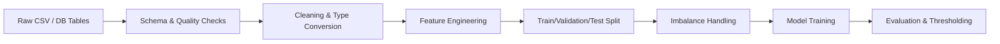

# Churn Prediction — Technical Approach

## Table of Contents
1. Data Pipeline and Governance
2. Feature Engineering
3. Handling Class Imbalance
4. Model Evaluation Protocol
5. Deployment and Monitoring Considerations

---

## 1) Data Pipeline and Governance

Data sources: Customer profile, subscription/contract, billing, service usage.  
Target: `Churn` (Yes/No) with 26.58% positives (imbalanced).

High-level pipeline:
```
Extract → Validate → Clean/Typecast → Join → Split → Transform → Train/Evaluate
```

Mermaid (conceptual):


Data quality:
- Type conversions (e.g., `TotalCharges` to numeric; drop/coerce invalids)
- Missing values: investigate mechanism; impute or drop minimally
- Duplicates and key integrity (customerID uniqueness)

Train/Validation/Test:
- Stratified splits to preserve churn ratio
- Hold-out test set for final evaluation

Governance:
- Version datasets and feature definitions
- Track data drift across monthly runs

---

## 2) Feature Engineering

Feature taxonomy aligned with business intuition:

Demographics:
- `SeniorCitizen`, `gender`, `Partner`, `Dependents`

Tenure & Contract:
- `tenure` (months with company)
- `Contract` type (month-to-month vs 1/2-year); encode robustly
- `PaperlessBilling`, `PaymentMethod`

Charges & Revenue:
- `MonthlyCharges` (current revenue)
- `TotalCharges` (proxy for lifetime value); consider `TotalCharges/tenure`
- Potentially engineered: churn risk increases for high `MonthlyCharges` with low tenure

Services/Bundle:
- `InternetService`, `OnlineSecurity`, `TechSupport`, `Streaming*`, `MultipleLines`
- Count of active services as `num_services`

Interactions (as needed, guided by importance):
- `Contract × tenure` (loyalty under contracts)
- `InternetService × OnlineSecurity/TechSupport` (value perception)

Preprocessing:
- Categorical encoding (one-hot/target encoding per cardinality)
- Scaling numeric features where required by model

Feature selection (conceptual):
- Mutual information / permutation importance to remove weak signals
- Guard against leakage: use only features available at scoring time

---

## 3) Handling Class Imbalance

Problem: 26.58% churn → naive models biased to "No".

Strategies:
- Class weights: penalize misclassifying churn higher (preferred for linear/tree models)
- Threshold moving: choose probability cutoff to match business costs (not necessarily 0.5)
- Resampling: SMOTENC for mixed numeric/categorical — use within CV folds to avoid leakage

Decision framework:
- Start with class weights + threshold tuning
- Use SMOTENC if minority recall remains insufficient (evaluate lift & stability)

---

## 4) Model Evaluation Protocol

Metrics:
- Primary: PR-AUC (robust for imbalance), Recall@K (operational capacity), F1 (balance)
- Secondary: ROC-AUC, calibration (Brier/Calibration curves) for probability quality

Thresholding by cost:
- Define cost(FP) (offer cost) vs cost(FN) (lost LTV)
- Choose threshold to minimize expected cost

Validation:
- Stratified K-fold CV for robust estimates
- Keep a hold-out test set for final metrics

Interpretability:
- SHAP/permutation importance to explain drivers (e.g., `Contract`, `tenure`, `MonthlyCharges`, `TechSupport`)
- Provide segment-level explanations for marketing actions

Operational metrics:
- Precision@Top-N (offer bandwidth), uplift vs random targeting
- Retention campaign acceptance rate among flagged cohort

---

## 5) Deployment and Monitoring Considerations

Serving:
- Batch scoring weekly/monthly for campaigns; real-time optional for proactive CX workflows
- Output: probability of churn + segment & top factors

Monitoring:
- Data drift (population stability index on key features)
- Performance drift (PR-AUC, recall at operational threshold)
- Calibration drift (reliability diagrams)

Retraining policy:
- Quarterly or on drift detection
- Recalibrate threshold with updated cost assumptions

Fail-safes:
- Human-in-the-loop for high-value accounts
- Guardrails to cap offer volume within budget

---

Deliverables:
- Scorecards for top decile risk cohorts
- Feature-attribution summaries per customer
- Business-ready KPIs: captured save rate, net lift, campaign ROI
