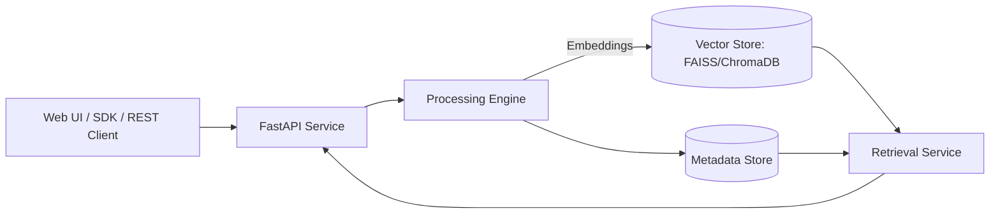
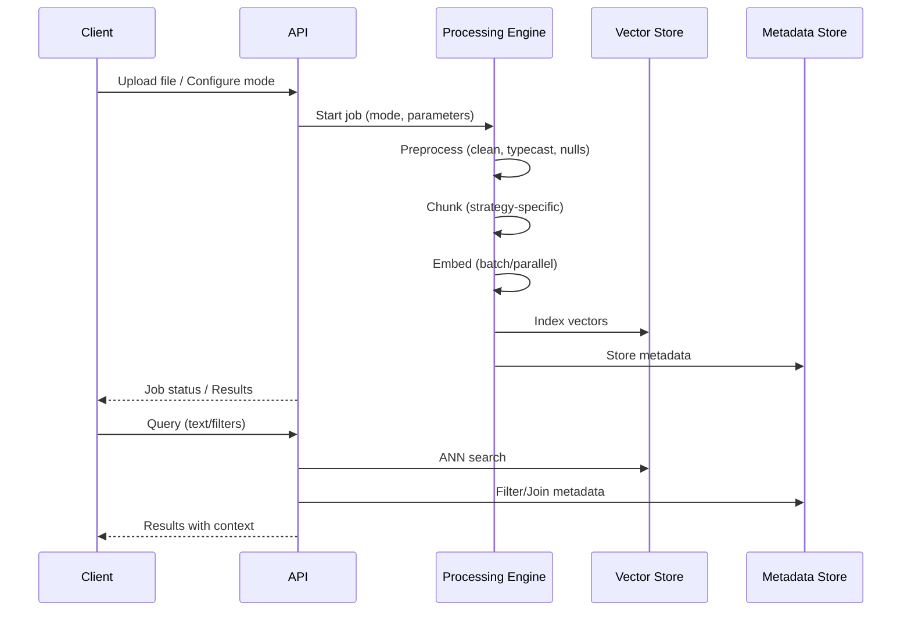

# iChunk Optimizer — Architecture

## Table of Contents
1. System Overview
2. Component Architecture
3. Data Flow and Processing Pipeline
4. Storage and Indexing
5. Scalability, Performance, and Reliability
6. Security and Governance

---

## 1) System Overview

iChunk Optimizer transforms large, semi-structured datasets (CSV/DB extracts) into a semantic vector index for retrieval and RAG systems. It exposes a REST API (FastAPI), optional web UI (Streamlit/React), and supports both local and cloud deployments.

High-level diagram:

---

## 2) Component Architecture

- FastAPI Service:
  - Endpoints for upload, configuration, processing modes, retrieval, export
  - Async request handling; job orchestration

- Processing Engine (backend.py/backends):
  - Preprocessing: clean, type conversion, nulls, normalization
  - Chunking strategies: fixed, recursive, semantic, document, campaign-specific
  - Embedding generation: local sentence-transformers or OpenAI-compatible
  - Parallelization: batch workers (e.g., 6 workers) for throughput

- Vector Store:
  - FAISS (local, high-performance) or ChromaDB (persistent, metadata-rich)
  - Similarity metrics: cosine, L2, dot-product

- Retrieval Service:
  - Query embedding, ANN search, metadata filtering, reranking (optional)

- UI Layer:
  - Streamlit (rapid UI) and/or React frontend

---

## 3) Data Flow and Processing Pipeline

Modes:
- Fast: defaults for quick processing (~60s/100K rows)
- Config-1: custom chunking/model/index
- Deep Config: 9-step pipeline with strict data quality
- Campaign: specialized grouping and field mapping

---

## 4) Storage and Indexing

- FAISS:
  - In-memory or on-disk indexes; IVF/HNSW variants for large-scale ANN
  - High-throughput, low-latency vector search

- ChromaDB:
  - Persistent collection with embeddings + metadata
  - Filtering on metadata fields (e.g., company, source)

Metadata:
- Store chunk provenance (source file, row range), strategy parameters, timestamps
- Enables auditability and targeted filtering

Export:
- CSV/JSON/NumPy; integrate with downstream analytics/RAG stack

---

## 5) Scalability, Performance, and Reliability

Scalability:
- Horizontal: multiple API/processing replicas behind load balancer
- Sharding: split collections by dataset/tenant/time
- Batch size tuning and worker parallelism for embedding throughput

Performance:
- Streaming I/O for 3GB+ files; bounded memory
- Vector index selection (IVF/HNSW) tuned for data shape
- Optional reranking for quality-critical retrieval

Reliability:
- Job checkpoints; resumable processing
- Persistent state for long-running tasks
- Health checks and backpressure for large uploads

---

## 6) Security and Governance

- Authentication/authorization on API (tokens/OAuth)
- Data hygiene: PII handling and redaction options
- Encryption at rest (DB) and in transit (TLS)
- Audit logs of operations (ingest, search, export)
- Config/version tracking for reproducibility
